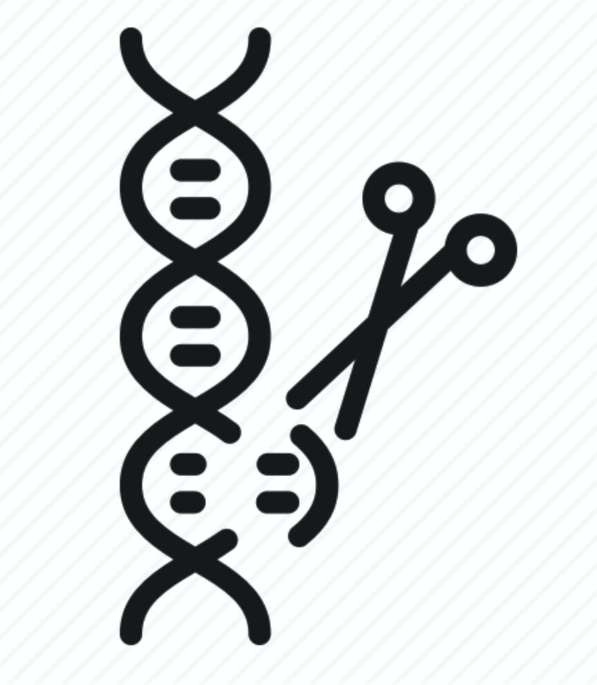
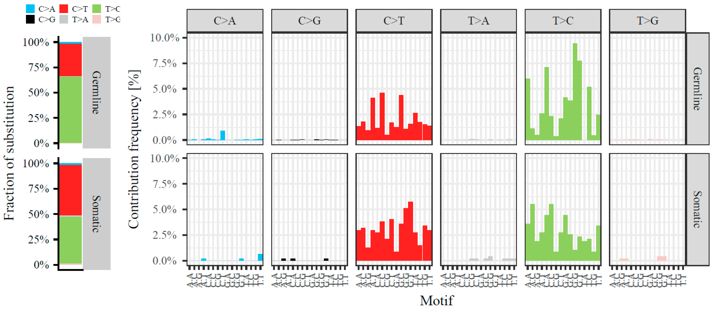
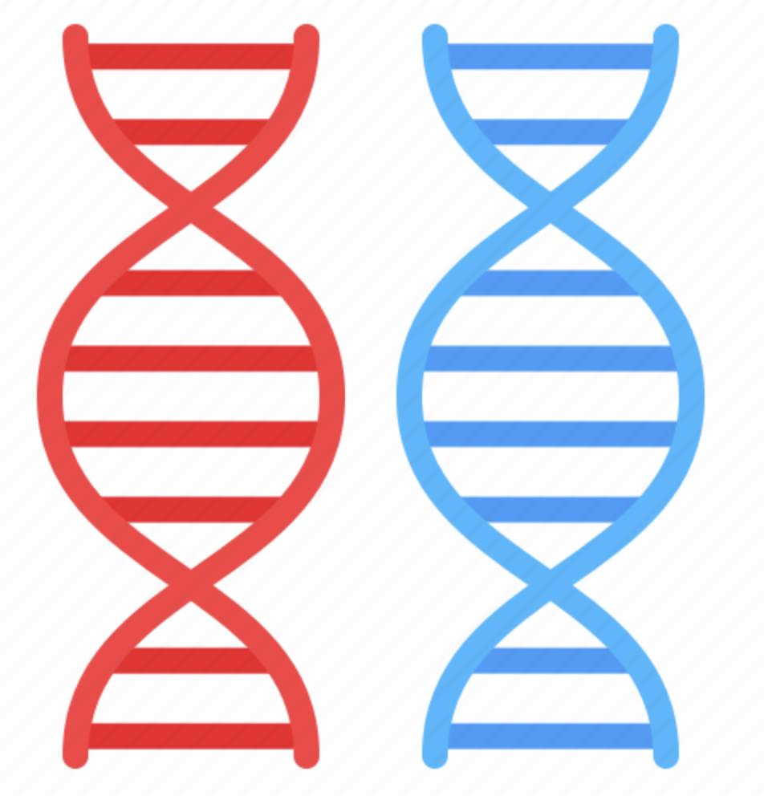
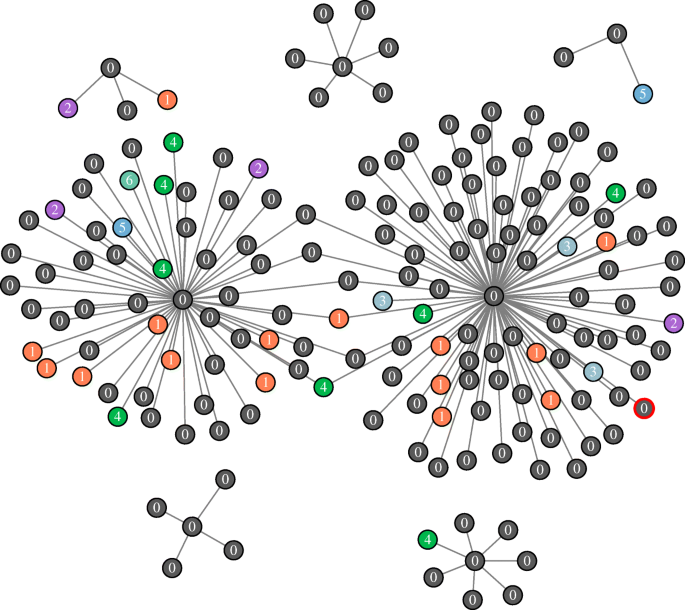

```{r setup, include=FALSE}
knitr::opts_chunk$set(echo = FALSE)
```


## Principales aplicaciones

- Estudio de splicing alternativo
- Detección de variantes y expresión alelo-específica
- Redes de co-expresión
- Fusión de genes

<div class="green">
- **Análisis de expresión diferencial**
</div>

## Estudio de splicing alternativo
<div class="columns-2">
  
<div class="black">  
  - El RNA-seq permite el estudio de nueveas "splice junctions" causadas por mutaciones
  - Caracterización de isoformas expresadas de manera tejido-específicas
  - Descubrir nuevas isoformas
  - El código del splicing alternativo pueda ser descifrado
</div>

## Detección de variantes
<div class="columns-2">
  
<div class="black">   
  - No es la principal estrategia para el estudio de variantes (WGS)
  - Presenta limitaciones relacionadas con la cobertura y la profundidad
  - El alineamiento de las lecturas requiere de la eliminación de secuencias duplicadas
  - El pipeline es similar al llamado de variantes para DNA-Seq
</div>

## Expresión alelo específica
<div class="columns-2">
  
<div class="black">  
  - SNP heterocigotos -> alelos distintos
  - Expresión diferencial de alelos -> desarrollo de enfermedades
  - RNA-seq permite conocer la expresión diferencial de los alelos
  - Secuencias codificantes y no codificantes del genoma
  - WGS y (variantes) y epigenómica (silencialmiento) para complementar los datos
</div>

## Redes de co-expresión
<div class="columns-2">
  
<div class="black">    
  - Asociación entre dos o más genes por medio de expresión coordinada
  - Genes co-expresados -> funciones relacionadas, mecanismos de regulación similar 
  - RNA-seq permite obtener redes de co-expresión más completas que los microarreglos
  - Requiere amplio número de muestras (al menos 20) 
</div>

## Análisis de expresión diferencial
<div class="black">   
- Aplicación más común del RNA-seq
- Permite identificar y cuantificar la expresión de transcritos entre dos grupos distintos
- Etapas del desarrollo, tejidos distintos, efecto de estímulos o tratamientos
- Requiere del uso de modelos estadísticos que evaluen la expresión diferencial 
- Normalización de los datos (tamaño de la librería, longitud de los genes, composición de la librería...)
</div>

