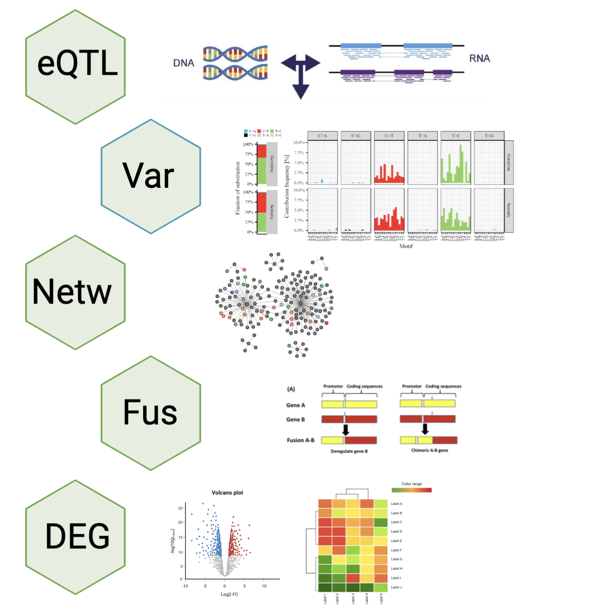
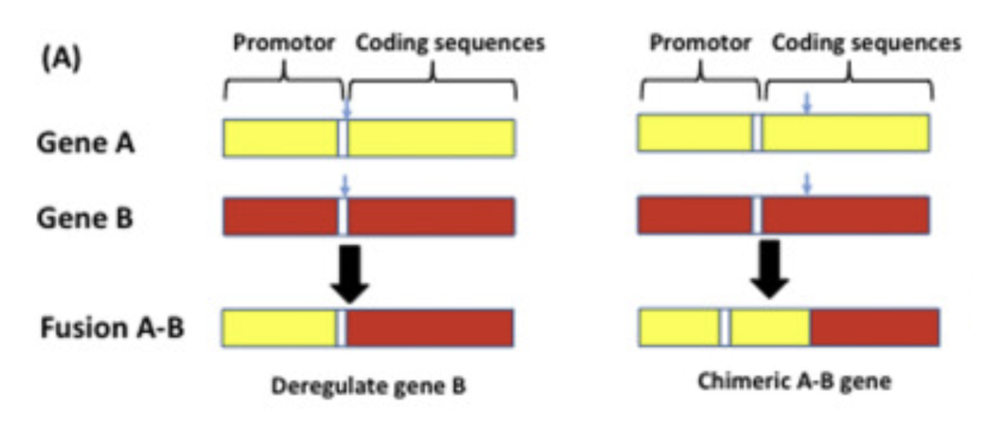
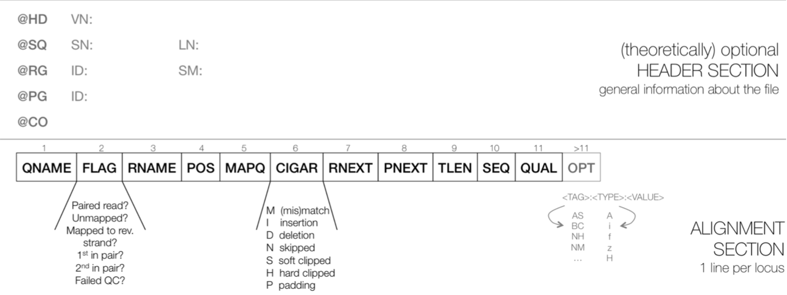
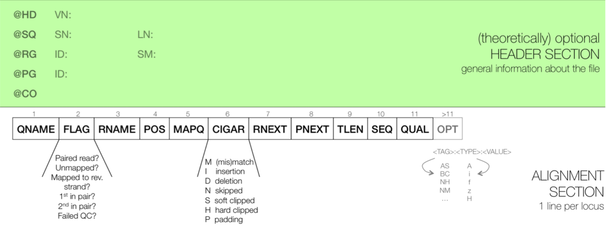
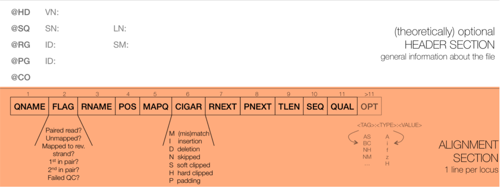
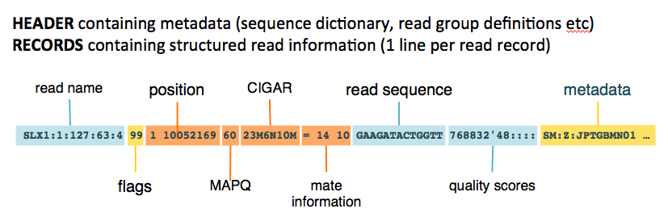
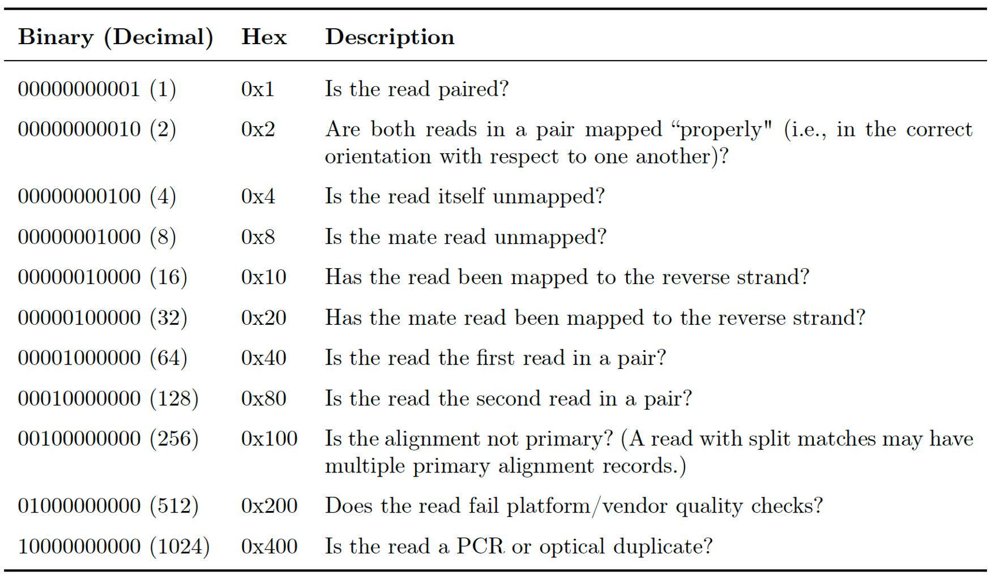
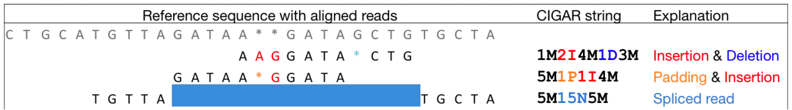
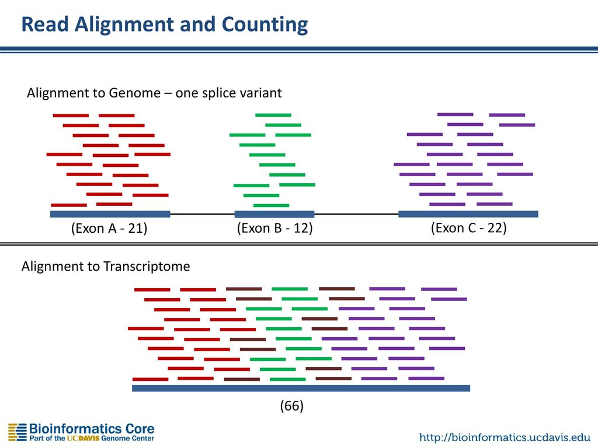

```{r, echo = F, include = F}
source("../bin/4.DE_analysis.R")
library(xaringanthemer)
style_xaringan(
  text_font_family = "Droid Serif",
  text_font_url = "https://fonts.googleapis.com/css?family=Droid+Serif:400,700,400italic",
  header_font_google = google_font("Yanone Kaffeesatz"), 
  colors = c(red = "#f34213",
  purple = "#3e2f5b",
  orange = "#ff8811",
  green = "#136f63",
  white = "#FFFFFF"
  )
)

```

```{css, echo = F}
/* From https://github.com/yihui/xaringan/issues/147  */
.scroll-output {
  height: 80%;
  overflow-y: scroll;
}
/* https://stackoverflow.com/questions/50919104/horizontally-scrollable-output-on-xaringan-slides */
pre {
  max-width: 100%;
  overflow-x: scroll;
}

.remark-slide-content {
  font-size: 28px;
  padding: 20px 80px 20px 80px;
}
.remark-code, .remark-inline-code {
  background: #f0f0f0;
}
.remark-code {
  font-size: 24px;
}
.huge .remark-code { /*Change made here*/
  font-size: 200% !important;
}
.tiny .remark-code { /*Change made here*/
  font-size: 80% !important;
}

.center2 {
  margin: 0;
  position: absolute;
  top: 50%;
  left: 50%;
  -ms-transform: translate(-50%, -50%);
  transform: translate(-50%, -50%);
}
```

---
# Aplicaciones

```{r, out.width="400px", fig.align='center', echo = F}

```

---

# Expresión cuantitativa de loci (EQTL)

--

- Relacionado con el estudio de rasgos y SNPs

--

- Asociación entre cambios en la expresión de genes a SNPs conocidos

--

- Determinar el efecto en el fenotipo -> mecanismos en *cis-* o en *trans-*

--

- WGS y (variantes) y epigenómica (silencialmiento) para complementar los datos

--

- Útil para la investigación de enfermedades o agronomía

--


---

# Detección de variantes

--

- Alternativa al estudio clásico de variantes (WGS o WES)

--

- Presenta limitaciones relacionadas con la cobertura y la profundidad (cobertura mayor a 10X)

--

- Se han reportado resultados en donde se identificaron > 8000 SNPs en músculo de *Longissimus thoraci*

--

- Enfocado en la porción transcrita del genoma


---

# Redes de co-expresión

--

- Asociación entre dos o más genes por medio de expresión coordinada

--

- Genes co-expresados -> funciones relacionadas, mecanismos de regulación similar 

--

- RNA-seq permite obtener redes de co-expresión más completas que los microarreglos

--

- Requiere amplio número de muestras (al menos 20) 

---

# Fusión de genes

--

- Asociado a eventos de rearreglos genómicos como amplificaciones, deleciones y translocaciones

--

- Región 5' gen A -> Region 3' gen B

--

- RNA-seq permite conocer fusiones génicas en el desarrollo de enfermedades como cáncer

--

- Permite conocer las diferencias en la expresión de genes fusionados entre dos condiciones



---

# Análisis de expresión diferencial


- Aplicación más común del RNA-seq

--

- Permite identificar y cuantificar la expresión de transcritos entre dos grupos distintos

--

- Etapas del desarrollo, tejidos distintos, efecto de estímulos o tratamientos

--

- Requiere del uso de modelos estadísticos que evaluen la expresión diferencial 

--

- Normalización de los datos (tamaño de la librería, longitud de los genes, composición de la librería...)

---
class: inverse, center, middle

# Tipos de archivos 

---
# Flujo de trabajo

```{r, out.width="550px", fig.align='center', echo = F}
knitr::include_graphics("./Images/RNAseq_workflow.png")
```

---

# FastQ

--

- Derivado del formato FASTA

--

- Id secuencia + **Calidad**

--

- Generalmente no está comprimido (.fastq) > comprimir (.fastq.gz)

--

- Comprende 4 líneas por secuencia:
  * @ ID del read + información de la corrida
  * Secuencia 
  * Símbolo "+"
  * Calidad (Escala **Phred** y código **ASCII**)
  
---

# FastQ  
## Identificador

--

- El identificador de la secuencia es la primera línea del archivo .fastq

--

- Plataformas de Illumina superiores a 1.8 contienen la siguiente información:

--

**@machneID:run number:flowCell ID:lane:tile:read:control number:index**

```{bash echo = F}
gzcat ../Data/s1_R1.fastq.gz | head -n 1
```

---

# FastQ
## Calidad

La calidad de cada base secuenciada, en la escala **Phred**, se calcula de acuerdo la siguiente ecuación:

.content-box-blue[
$$Q = -10 * log10(p)$$
]

--

Q = Calidad 

--

p = Probabilidad de que el *base call* sea incorrecto

--

Valores de **p** cercanos a cero -> Alta calidad

--

¿Cuál es la calidad si el valor p del basecall es de 0.01?

--

$$Q = -10 * log10(0.01) = -10 * -2 = 20$$

---
# Fastq
## Calidad

```{r, out.width="700px", fig.align='center', echo = F}
knitr::include_graphics("./Images/Fastqc.png")
```


---
# FastQ
## Calidad

--

- Para evitar colocar los valores numéricos de la calidad en el archivo .fastq y saturarlo de información -> **[ASCII](https://www.ascii-code.com/)**

--

- Phred + 33 -> Plataformas de Illumina a partir de 1.8 (símbolos especiales + alfanuméricos)

--

- Phred + 64 -> Plataformas de Illumina anteriores a 1.8


```{r, out.width="400px", fig.align='center', echo = F}
knitr::include_graphics("./Images/ASCII0.png")
```


```{r, out.width="400px", fig.align='center', echo = F}
knitr::include_graphics("./Images/ASCII33.png")
```

---

# FastQ


```{r, out.width="700px", fig.align='center',echo = F}
knitr::include_graphics("./Images/Fastq.png")
```

---

# SAM/BAM

--

- De manera posterior al alineamiento se generan archivos **"Sequence Alignment Map"** -> **SAM**

--

- Archivos delimitados por tabuladores (TAB)

--

- Convertidos a valores binarios como **"Binary Alignment Map"** -> **BAM**

--

- **BAM** -> Mayor espacio en disco -> Acceso aleatorio más eficiente

--

- Las secuencias en formato BAM se pueden ordenar por coordenadas

--

- Conversion entre formatos [SamTools!](https://github.com/samtools/samtools)

---

# SAM/BAM

- Los archivos en formato **SAM** se dividen en dos secciones:

--

- **HEADER**: Información general del archivo

--

- **ALIGNMENT**: Información relacionada con el alineamiento de los reads

--
```{r, out.width="550px", fig.align='center', echo = F}

```

---


```{r, out.width="600px", fig.align='center', echo = F}

```

--

- La sección HEADER incuye unformación sobre cómo se generó el alineamiento y su almacenamiento

--

- **Todas** las líneas del HEADER están separadas por tabuladores

--

- La estructura general de las líneas es la siguiente:

   @ TAG:VALUE

* TAG: Código de dos letras -> Contenido
* VALUE: Valores del TAG

---

# SAM/BAM
##HEADER

Ejemplos de diferentes **TAG**:

--

- @HD -> Metadatos del alineamiento

--

- @SQ -> Datos de la secuencia de referencia

--

- @RG -> Grupo de lecturas 

--

- @PG -> Información del alineador y el código del alineamiento

---

```{r, out.width="600px", fig.align='center', echo = F}

```

--

Esta sección procede al **HEADER** y contiene:

--

- Cada línea corresponde a una lectura alineada

--

- Para cada lectura se muestran los resultados de los siguientes campos obligatorios:

```{r, out.width="400px", fig.align='center', echo = F}

```


---

# SAM/BAM
## FLAG

--

- Los valores del FLAG contestan preguntas relacionadas con el alineamiento del read

--

- Sí = 1, No = 0

--

- Cada respuesta se encuentra codificada en valores **binarios, decimales y hexadecimales**

--

- Información útil para lecturas pareadas -> ¿La lectura es pareada? 
¿Ambos reads alinearon adecuadamente?

---

# SAM/BAM
## FLAG

```{r, out.width="600px", fig.align='center', echo = F}

```

---

# SAM/BAM
## Concise Idiosyncratic Gapped Alignment Report (CIGAR)

- Almacena información relacionada con las operaciones necesarias para alinear el read
- Se reporta con valores alfanuméricos:

--
  * M -> Alineamiento correcto
  * I -> Inserción comparado con la referencia
  * D -> Deleción comparado con la referencia
  * N -> Región con corrimiento (intrón)
  * S -> Soft clipping
  * H -> Hard clipping
  * P -> Padding o mutación silenciosa

--
---
 
# SAM/BAM
## CIGAR

```{r, out.width="600px", fig.align='center', echo = F}

```

---
class: inverse, center, middle

# Organización de un proyecto bioinformático

---

# Crisis de reproducibilidad en la ciencia

La reproducibilidad en la ciencia implica que dos o más personas (o grupos de trabajo) realicen el mismo experimento bajo condiciones experimentales similares y obtengan resultados similares.

Para ello se requiere los siguientes elementos:

--

- Descripción de materiales y métodos

--

- Datos crudos o semi-crudos

--

- Código de cómputo utilizado

--

- Versión del software utilizado

--

- Información suplementaria para realizar el análisis de los datos

---

# Crisis de reproducibilidad en la ciencia

Actuamente, existe una **crisis de reproducibilidad** en la ciencia -> Perseguir explicaciones incorrectas -> Diseñar tratamientos incorrectos para ciertas enfermedades

Para combatir este problema:

--

- Transparencia de datos en publicaciones científicas

--

- Apertura de la información (Open science)

--

- Código abierto para el análisis de datos

--

- Repositiorios o bases de datos públicas donde se almacene la información

--

- Software depositado en repositorios o servidores a largo plazo

---

# Crisis de la reproducibilidad en la ciencia

```{r, out.width="400px", fig.align='center', echo=F}
knitr::include_graphics("./Images/Repo.png")
```


Proyecto organizado en directorios y subdirectorios para reproducir el análisis de datos

---

# Organización del proyecto  
## README

Un **README** es un archivo en texto plano (formado .md) que permite documentar el proyecto

--

- El contenido de un proyecto (repositorio)

--

- Las funciones de los scripts contenidos en el proyecto

--

- El orden en el cual deben ser ejecutados los scripts para realizar los análisis

--

- Software necesario para los análisis

--

- Información suplementaria sobre los datos/scripts/software

--

La función del **README** es explicar la organización del proyecto y que otros entiendan su contenido

---

# Organización del proyecto  
## README

Tips:

--

- Importante actualizar el README durante el desarrollo del proyecto

--

- Editarlo en formato plano (Nano, TextWrangler, MacDown, ...)

--

- Información clara y concisa

```{r, out.width="600px", fig.align='center', echo=F}

```


---

# Organización del proyecto  
## Datos

Los datos deben de almacenarse en un directorio especial (considerar espacio en disco):

--

- Datos crudos

--

- Datos semi-crudos

--

- Datos procesados

--

Considerar almacenar los datos en un repositorio como respaldo [OSF](https://osf.io/)

---

# Organización del proyecto  
## Datos

Es recomendable llevar una tabla de metadatos durante el desarrollo del proyecto:

--

- Almacenar información de cada muestra

--

- Información de la corrida -> Lotes

--

- Comentarios respecto a la corrida

--

- Fechas de creación/modificación de los datos

---

# Organización del proyecto
## Código

**El código es una de las partes más importantes del proyecto**

--

- Instrucciones que recibe el equipo para el análisis de datos

--

- Diseñado  a partir del pipeline o estrategia para abordar el análisis de datos

--

- Elemento dinámico dentro del proyecto

--

```{r, out.width="400px", fig.align='center', echo=F}

```

---

# Organización del proyecto
## Código

--

- Enumerar los scripts de acuerdo al orden en que serán ejecutados

```
+-- 1.QualityControl.sh
+-- 2.Trimming.sh
+-- 3.ReadAlignment.sh
+-- 4.DifferentialExpression.R
```

--

- Utilizar rutas relativas hacia los archivos *input*

```
fastqc ../Data/*.fastqc -o ../Results/
```
--

- Comentar el script -> facilita que sea entendido por humanos

```
#Change the location of bam files
mv ../Data/*.bam ../Results/
```
--

- ¡Mejorar el código! -> *Less is more*

---

.center[]

---

# Organización del proyecto
## Código
.pull-left[
- **[DRY](https://en.wikipedia.org/wiki/Don%27t_repeat_yourself)** Don't Repeat Yourself

- **[KISS](https://en.wikipedia.org/wiki/KISS_principle)** Keep It Simple Soldier

- **[YAGNI](https://en.wikipedia.org/wiki/You_aren%27t_gonna_need_it)** You Aren't Gonna Need It

- **[POLA](https://en.wikipedia.org/wiki/Principle_of_least_astonishment)** Principle of Least Astonishment

- **[POLP](https://digitalguardian.com/blog/what-principle-least-privilege-polp-best-practice-information-security-and-compliance)** Principle of Least Privilege
]
.pull-right[
```{r, out.width="200px", fig.align='right', echo=F}

```
]

---
# Organización del proyecto
## Resultados

```{r, out.width="700px", fig.align='center', echo=F}

```

---
# Organización del proyecto
```{r, out.width="450px", fig.align='center', echo = F}
knitr::include_graphics("./Images/Proyecto.png")
```

---
# Experimento

Número de acceso GEO: GSE152699

---
class: inverse, center, middle

# Alineamiento
---

```{r, out.width="600px", fig.align='center', echo = F}
knitr::include_graphics("./Images/RNAseq_workflow2.png")
```
Imagen tomada de [aquí](https://biocorecrg.github.io/RNAseq_course_2019/salmon.html)
---

# Alineamiento
```{r, out.width="600px", fig.align='center', echo = F}

```

Buscar la región del genoma/transcriptoma a partir de la cual se originaron los reads

---

# Alineamiento

- Indexar genoma/transcriptoma (FASTA, GTF3/GFF3)

```{r, out.width="500px", fig.align='center', echo = F}
knitr::include_graphics("./Images/GenomeIndexing.png")
```

--

- Alinear los reads (Fastq) al genoma/transcriptoma indexado

```{r, out.width="500px", fig.align='center', echo = F}
knitr::include_graphics("./Images/ReadAlignment1.png")
```

Imágenes tomadas de [aquí](https://almob.biomedcentral.com/articles/10.1186/s13015-016-0069-5/figures/1) y [aquí](https://figshare.com/articles/figure/_Comparison_of_stranded_and_unstranded_RNA_seq_library_methods_and_their_influence_on_interpretation_and_analysis_/1504417/1)
---

# Alineamiento
## Spliced reads 

```{r, out.width="600px", fig.align='center', echo = F}
knitr::include_graphics("./Images/SplicedReads2.png")
```

---

# Alineamiento

Alineadores tipo splice aware -> Alineamiento de secuencias exon spanning -> Segmentan las secuencias en las regiones de dos exones

- TopHat 2
```{r, out.width="600px", fig.align='center',echo = F}
knitr::include_graphics("./Images/SpliceAware.png")
```

--

- HISAT
```{r, out.width="600px", fig.align='center', echo = F}
knitr::include_graphics("./Images/HISAT.png")
```

--

- STAR
```{r, out.width="400px", fig.align='center', echo = F}
knitr::include_graphics("./Images/STAR.png")
```
Imágenes tomadas de [aquí]()
---

# Alineamiento
## Pseudo-alineadores

Pseudo-alineadores (quasi-alineadores):

- Kallisto

- Sailfish

- **Salmon**

---

# Alineamiento
## Pseudo-alineadores

```{r, out.width="600px", fig.align='center', echo = F}
knitr::include_graphics("./Images/Pseudoalignment.png")
```


---

# Alineamiento
## Pseudo-alineadores

```{r, out.width="500px", fig.align='center', echo = F}
knitr::include_graphics("./Images/PseudoAlignment1.png")
```

--

```{r, out.width="500px", fig.align='center', echo = F}
knitr::include_graphics("./Images/PseudoAlignment2.png")
```

---

# Alineamiento
## Pseudo-alineadores

```{r, out.width="600px", fig.align='center', echo = F}
knitr::include_graphics("./Images/PseudoAlignment3.png")
```

---
background-size: cover
class: center, bottom, inverse
background-image: 
```{r, echo = F}
knitr::include_graphics("./Images/hands_on.png")
```

---
# Hands on
## Generar índice del transcriptoma

Para ello vamos a requerir:

--

- Archivo **Fasta** del transcriptoma de referencia del humano.

Descargado del sitio de [GeneCode](https://www.gencodegenes.org/human/)

Lo pueden encontrar en el folder de `Transcriptome/`

--

- Código para genear el índice

```
salmon index -t --genecode path_to_transcriptome.fa.gz -i path_to_save_index
```

`-t`: Ubicación al archivo Fasta del transcriptoma

`-i`: Ubicación para salvar el índice

`--genecode`: El Fasta del transcriptoma de referencia está en formato de GENECODE

---
# Hands on
## Cuantificar la abundancia de los transcritos

Requerimientos:

--

- Archivos **Fastq** de las lecturas -> Paired end R1 y R2

Ubicados en el folder de `data`

--

- Índice generado en el paso anterior

--

- Código para producir cuantificar los transcritos

```
salmon quant -i path_to_index 
             -l A -1 path_to_R1 -2 path_to_R2 
             -o path_to_store_results
```
`-i`: Ubicación del índice

`-l`: Tipo de librería

`-1 y -2`: Ubicación a las lecturas R1 y R2

`-o`: Ubicación para almacenar los resultados

---

```{bash engine.opts = '-l', eval = F}
##Crear un directorio para almacenar los datos de los conteos
mkdir -p ../salmon_quant
##Llamar salmon para realizar el conteo
salmon quant -i ../transcriptome/genecode.v37.salmon141 \
             -l A \
             -1 ../Data/s1_R1.fastq.gz -2 ../Data/s1_R2.fastq.gz \
             -p 6 --validateMappings \
             -o ../salmon_quant/s1_quant
```
---
class: inverse, center, middle

# Objeto Summarized Experiment
---

.center2[
```{r, out.width="700px", echo=FALSE}
knitr::include_graphics("./Images/Slots.png")
```
]
---

# Summarized Experiment

```{r, out.width="400px", fig.align='center',echo = FALSE}
knitr::include_graphics("./Images/Summarized_experiment.png")
```

---
# Summarized Experiment

```{r, out.width="400px", fig.align='center', echo = F}
knitr::include_graphics("./Images/ColData.png")
```

---

# Summarized Experiment
## ColData

--

- El cajón o slot correspondiente a `ColData` contiene la tabla de metadatos creada para importar las cuentas con tximeta

--

- Para acceder a **.red[ColData]** usar el siguiente comando:
.tiny[
```{r}
colData(se)
```
]
---

# Summarized Experiment
## ColData

- El slot **ColData** es un objeto con clase de *DataFrame*
.tiny[
```{r}
class(colData(se))
```
]
--

- *Rownames* de **ColData** corresponden a los *Colnames* en el slot **Assay**- **.red[Importante para análisis con DESeq2]**
.tiny[
```{r}
rownames(colData(se))
```
]
---

# Summarized experiment

```{r, out.width="400px", fig.align='center', echo = F}
knitr::include_graphics("./Images/RowRanges.png")
```

---
# Summarized experiment
## rowRanges
- El cajón de `rowRanges` hace referencia a las coordenadas de cada transcrito

--

- Para acceder al **.red[rowRanges]** usar:
.tiny[
```{r}
rowRanges(se)
```
]
---

# Summarized experiment

```{r, out.width="400px", fig.align='center', echo = F}
knitr::include_graphics("./Images/Assay.png")
```

---
# Summarized experiment
--

- El slot `assay` almacena la información de las cuentas para cada transcrito dividida en tres niveles:

--

.tiny[
```{r}
assayNames(se)
```
]
--

- Para acceder a la matriz de cuentas estimadas por *Salmon*, correr:

.tiny[
```{r}
head(assay(se), 5)
```
]

---
# Summarized experiment
## Assay
- Las matriz de abundancia *(TPM)* puede obtenerse:

.tiny[
```{r}
## Obtener matriz de TPM
head(se@assays@data$abundance, 5)
```
]

---
# Summarized experiment

¿Recuerdan a qué tiene que ser igual *Rownames* del slot colData?

--
.tiny[
```{r}
rownames(colData(se))
```


--

```{r, echo=T}
colnames(assay(se))
```


--

```{r}
## Comprobar que rownames de colData es igual a colnames de assay
row.names(colData(se)) == colnames(assay(se))
```
]
---
class: inverse, center, middle

# Exploración de los datos
---


.center2[
```{r, out.width="700px", echo = F}
knitr::include_graphics("./Images/PCAplot.png")
```
]

---
# Exploración de datos
## ¿Por qué es importante explorar los datos?

--

- Paso previo al análisis de expresión diferencial

--

- Análisis de calidad de los datos

--

- Permite conocer la congurencian entre individuos o réplicas 

--

- Mediante gráficos, visualizar comportamiento de los datos -> Outliers

---
# Exploración de datos

.pull-left[
```{r, out.width="400px", echo = F}
knitr::include_graphics("./Images/PCAplot2.png")
```

]
--
.pull-right[
```{r, out.width="400px", echo = F}
knitr::include_graphics("./Images/Heatmap.png")
```

]

---
# Exploración de datos

.pull-left[
```{r, out.width="400px", echo = F}
knitr::include_graphics("./Images/PCAplot2.png")
```
**.red[PCA]**
]

.pull-right[
```{r, out.width="400px", echo = F}
knitr::include_graphics("./Images/Heatmap.png")
```
**.red[Heatmap]**
]

---
# PCA

--

- Análisis de componentes principales

--

- Método algebraico para reducir la dimensionalidad de sets de datos complejos (múltiples variables)

--

- Reducción de dimensionalidad o variables permite un análisis exploratorio más intuitivo

--

- Reducción de variables implica  preservar y captar la mayor información sobre los datos

---
# PCA
## Normalización de los datos
--

```{r, out.width="350px", fig.align='center', echo = F}
knitr::include_graphics("./Images/zscore.png")
```

Escalación de los datos -> Normalización para hacerlos más comparables

--

```{r, out.width="350px", fig.align='center', echo = F}
knitr::include_graphics("./Images/covariancematrix.png")
```

Busqueda de correlación entre las variables -> correlación positiva o negativa

---
# PCA
## Proyección de los datos

.center[

]

--
.content-box-red[Los componentes principales son los nuevos ejes que maximizan la distancia de los datos al origen
]

---
# PCA
## Componentes principales

--

- El .green[primer componente] es aquel en el que los datos presentan la mayor separación (variación)

--

- El .orange[segundo componente] es el que tiene la segunda mayor separación entre los datos y es perpendicular al primer componente

--

- ¿Cuantos componentes existen? -> tantas variables en el set de datos


---
# PCA
## Componentes principales

- Cada componente principal tiene asociado un eigenvector (vector unitario) y un eigenvalue (cantidad escalar)

--

- Los eigenvalues son la suma del cuadrado de las distancias de los puntos proyectados sobre dicho componente principal

--

- Los eigenvalues permiten seleccionar cuál es el componente principal que explica la mayor variación en los datos

---
# PCA

```{r, out.width="450px", fig.align='center', echo = F}
knitr::include_graphics("./Images/Screeplot.png")
```
Screeplot


---
# PCA

- En sets de datos de RNAseq, el PCA permite visualizar la distancia o congruencia de los datos

--

- Generalmente son gráficas de puntos (muestras) en dos dimensiones (dos componentes) que resumen las principales fuentes de varianza

--
.center[
```{r, out.width="400px", echo = F}
knitr::include_graphics("./Images/PCARNAseq.png")
```
]

---
# PCA
## ¿Cómo crear nuestro propio PCA?

- Primero instalen las siguientes librerías:
.tiny[
```{r, eval = F}
library(DESeq2)
library(PCAtools)
```
]

--

- Usemos la siguiente normalización logarítmica de las cuentas (toma en cuenta el tamaño de la librería)
.tiny[
```{r, eval = F}
## Transformación recomendada para sets de con menos de 30 muestras
rld <- rlog(dds, blind = F)
```
]

- Si tuvieramos un número mayor de muestras (n > 30) entonces conviene:
.tiny[
```{r, eval = F}
vsd <- vst(dds, blind = T)
```
]
---
# PCA

- Usemos la función interna de *DESeq2* para graficar nuestro PCA:
.tiny[
```{r, eval = FALSE}
## El argumento intgroup permite especificar mediante cuál variable colorear los datos
plotPCA(rld, intgroup = "condition")
```
]

.content-box-red[*DESeq2* por medio de `plotPCA` evalua la varianza de los 500 genes con mayor varianza del set de datos
]


- Con la librería de *PCAtools*:
.tiny[
```{r, eval = F}
## Crear un objeto que contenga los datos del PCA
PCA <- pca(assay(rld), scale = T, metadata = coldata) 
## Graficar en 2D los resultados
biplot(PCA, colby = "condition")
## Generar un screeplot para visualizar la varianza asociada a cada componente
screeplot(PCA)
```
]

---

.center[
]

---
# PCA
## ¿Cómo ven los resultados?
```{r, echo = F, include = F}
ggplot()+
  theme_set(theme_bw())
```

--

.pull-left[**DESeq2**
```{r,echo = F,dpi=300, out.width= "350px", fig.align='center'}
plotPCA(rld, intgroup = "condition")+
  geom_label_repel(aes(label = colnames(assay(rld))), 
                   segment.color = "grey50", 
                   box.padding = 0.35, 
                   point.padding = 0.5)
```
]
--
.pull-right[**PCA tools**
```{r, echo = F, dpi=300, out.width="350px", fig.align='center'}
biplot(PCA, lab = colnames(assay(rld)), colby = "condition", legendPosition = "right")
```
]

---
# PCA
## ¿Cuánta varianza es explicada por cada componente?

```{r, dpi=300,out.width="400px", fig.align='center', echo = F, warning=FALSE}
screeplot(PCA)
```

---
# PCA y MDS
.scroll-output[
Generemos un MDS plot interactivo con los datos. Para ello usemos la librería de *Glimma* y la función de `GlimmaMDS`

```{r}
glimmaMDS(dds)
```
]
---
class: inverse, center, middle

# Visualización de los resultados
---

.center[
### ¿Cuántos tipos de gráficos conoces para visualizar resultados del análisis DE?
]

.pull-left[
```{r, out.width="350px", echo = F}
knitr::include_graphics("./Images/MAplot.png")
```
]

.pull-right[
```{r, out.width="350px", echo = F}
knitr::include_graphics("./Images/Volcanoplot.png")
```
]

---
.center[
### ¿Cuántos tipos de gráficos conoces para visualizar resultados del análisis DE?
]

.pull-left[
```{r, out.width="350px", echo = F}
knitr::include_graphics("./Images/MAplot.png")
```
**.green[MAplot]**
]

.pull-right[
```{r, out.width="350px", echo = F}
knitr::include_graphics("./Images/Volcanoplot.png")
```
**.green[Volcano plot]**
]

---
# MAplot

- Gráfico que representa la distribución de los genes o transcritos en las comparaciones de interés

- **M** eje y de *minus* -> $$logTx - logCT = logTx/CT$$

- **A** eje x de *average* -> Promedio de las cuentas normalizadas para cada gen en todas las muestras

- Para generar el **MAplot** usemos el siguiente comando:

.tiny[
```{r, eval = F}
##Es importante que recuerden que la hipótesis nula que se probó fue
##"El lfc del gen n es igual a 0" por lo tanto los genes coloreados son...
plotMA(res)
```
]
---
# MAplot

```{r, echo = F, dpi=200, out.width="450px", fig.align='center'}
plotMA(res)
```

---
# MAplot

Para tener una mejor estimación del LFC de genes que:

- Son poco abundantes

- Tienen alta dispersión

Usemos la función `lfcShrink` de la librería *.red[apeglm]*

.tiny[
```{r, eval = F}
##En el argumento coef indicar el contraste entre los grupos experimentales
res <- lfcShrink(dds, coef = "condition_Verafinib_vs_Control",  type = "apeglm")
##Si desconocemos el nombre del contraste, usar:
resultsNames(dds)
```
]

---
# MAplot
.pull-left[
```{r, echo = F, dpi=200, out.width="450px", fig.align='center'}
plotMA(res)
```
]

.pull-right[
```{r, echo = F, dpi=200, out.width="450px", fig.align='center'}
plotMA(res2)
```
]
---
# MAplot
.scroll-output[
También pueden generar un MAplot interactivo con la librería de *Glimma*
```{r}
glimmaMA(dds)
```
]
---
# Volcano plot

De manera similar al MAplot con el volcano plot visualizamos los genes que muestran expresión diferencial en nuestra condición de interés

- En el eje y se grafica el -log10 de padj

- En el eje x se grafica el lfc o *log2foldchange*

.tiny[
```{r, eval = F}
##Para crear un volcano plot necesitas convertir los resultados de DESeq a un data frame
DEG <- as.data.frame(res)
##En el script de funciones encontrarás la función de volcanoplotR para generar tu gráfico
#los valores de los argumentos logfc y p.adj deben ser iguales al threshold utilizado para generar los resultados
#en type debes indicar que los resultados provienen de DESeq
volcanoplotR(DEG, logfc = 0, p.adj = 0.1, type = "DESeq")
```
]

---
# Volcano plot

```{r, echo = F, dpi=200, out.width="450px", fig.align='center'}
volcanoplotR(DEG, logfc = 0, p.adj = 0.1, type = "DESeq")
```

---

# Heatmap

El *heatmap* nos permite visualizar la expresión de los genes diferencialmente expresados en terminos de las cuentas normalizadas

Consideraciones:

- Usar los valores de las cuentas normalizadas para una mejor comparación entre muestras

- Escalar los valores de las cuentas (renglones) para visualizar las diferencias en la expresión

Usaremos la librería de *.red[pheatmap]*

---
# Heatmap

.tiny[
```{r, eval = F}
##Guardar la lista de transcritos que mostraron expresión diferencial significativa
significant <- res_df %>% filter(log2FoldChange > 0 & padj < 0.1 |
                                   log2FoldChange < 0 & padj < 0.1)
##Cortar la matriz de cuentas normalizadas con los id de los transcritos diferencialmente expresados
norm_counts <- norm_counts[rownames(significant)]
##Generar una tabla de anotaciones preservando el tratamiento y el tipo de células
annotation_col <- coldata[, c(3, 4)]
##Generar el heatmap empleando clustering jerarquico
pheatmap(norm_counts, 
         border_color = NA, 
         scale = "row",
         clustering_distance_rows = "euclidean", 
         clustering_distance_cols = "euclidean", 
         clustering_method = "average", 
         show_colnames = F, 
         show_rownames = F, 
         annotation_col = annotation_col)
```
]

---
# Heatmap

```{r, echo = F, dpi=200, out.width="450px", fig.align='center'}
pheatmap(norm_counts, 
         border_color = NA, 
         scale = "row",
         clustering_distance_rows = "euclidean", 
         clustering_distance_cols = "euclidean", 
         clustering_method = "average", 
         show_colnames = F, 
         show_rownames = F, 
         annotation_col = annotation_col)
```


