class: inverse, center, middle

# Agradecimientos

```{r xaringan-themer, echo = F, include = F}
library(xaringanthemer)
style_mono_accent(base_color = "#23395b")
```

```{css, echo = F}
/* From https://github.com/yihui/xaringan/issues/147  */
.scroll-output {
  height: 80%;
  overflow-y: scroll;
}
/* https://stackoverflow.com/questions/50919104/horizontally-scrollable-output-on-xaringan-slides */
pre {
  max-width: 100%;
  overflow-x: scroll;
}

.remark-slide-content {
  font-size: 28px;
  padding: 20px 80px 20px 80px;
}
.remark-code, .remark-inline-code {
  background: #f0f0f0;
}
.remark-code {
  font-size: 24px;
}
.huge .remark-code { /*Change made here*/
  font-size: 200% !important;
}
.tiny .remark-code { /*Change made here*/
  font-size: 80% !important;
}

.center2 {
  margin: 0;
  position: absolute;
  top: 50%;
  left: 50%;
  -ms-transform: translate(-50%, -50%);
  transform: translate(-50%, -50%);
}
```

```{r setup, include=FALSE}
knitr::opts_chunk$set(echo = FALSE)
```

```{r, echo = F, include = F}
source("../bin/4.DE_analysis.R")
```


---
## Agradecimientos

Este material está basado en [Love, Michael I., et al. "RNA-Seq workflow: gene-level exploratory analysis and differential expression." F1000Research 4 (2015).](https://www.bioconductor.org/packages/devel/workflows/vignettes/rnaseqGene/inst/doc/rnaseqGene.html) de Bioconductor.

```{r, out.width = "300px",fig.align='center'}
knitr::include_graphics("https://images.squarespace-cdn.com/content/v1/5423875be4b03f0c482a58c4/1532953317705-W6TYTE70KG5E6KQEZU1K/ke17ZwdGBToddI8pDm48kNVP8RwsgCc7XlHc2zPQeqdZw-zPPgdn4jUwVcJE1ZvWQUxwkmyExglNqGp0IvTJZUJFbgE-7XRK3dMEBRBhUpxA5wn4368HhrDKfvXqORu9oTEmTJkjlQ2gdQcVngofpWQcE5w-MKnvigIPwIMqpXs/Bioconductor.png")
```

---
## Agradecimientos

También está basado en el curso de ["Next generation sequencing bioiformatics" (Santiago, Chile 2019)](https://coursesandconferences.wellcomegenomecampus.org/our-events/next-generation-sequencing-bioinformatics-chile-2019/).

```{r, out.width = "600px",fig.align='center'}
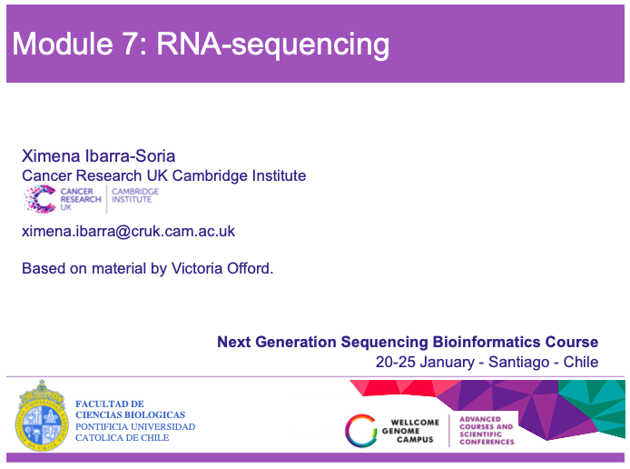
```

---
## Agradecimientos


```{r, out.width = "600px", fig.align = "center"}
knitr::include_graphics("https://i0.wp.com/alcanzandoelconocimiento.com/wp-content/uploads/2019/11/Conabio-Logo-02.jpg?w=1024&ssl=1")
```

---
class: inverse, center, middle

# 1: Introducción al RNA-seq

---
## Transcriptómica

Estudio de la expresión genética

- ¿Cuánto RNA hay?

```{r, out.width = "900px",fig.align='center'}
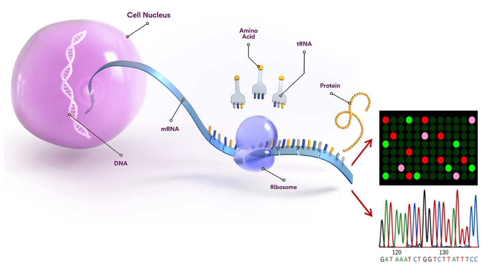
```

---

## Tecnologías

```{r, out.width = "800px",fig.align='center'}
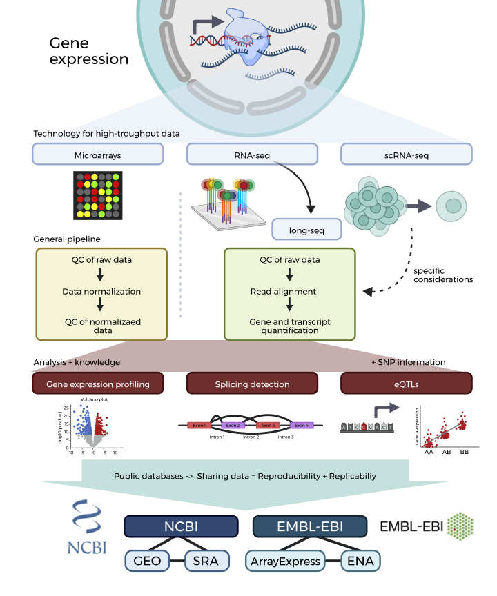
```


---
## RNA-seq


```{r, out.width = "660px",fig.align='center'}
knitr::include_graphics("https://upload.wikimedia.org/wikipedia/commons/thumb/f/f3/Summary_of_RNA-Seq.svg/800px-Summary_of_RNA-Seq.svg.png")
```

---

## Aplicaciones

```{r, out.width = "570px",fig.align='center'}

```

---

## Bases de datos

```{r, out.width = "450px",fig.align='center'}

```

---

class: inverse, center, middle

# 2: Organización de un proyecto bioinformático

---

## Organización del proyecto

```{r, out.width="400px", fig.align='center', echo=F}
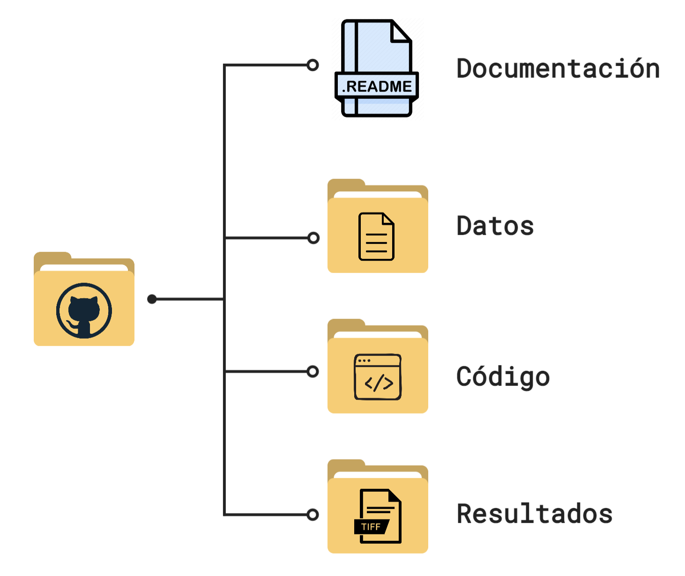
```


Almacenar el proyecto en .blue[GitHub] `r icons::icon_style(icons::fontawesome("github"), fill = "blue")` para el control de versiones 

---

## Organización del proyecto  

- La función del **README** es explicar la organización del proyecto y que otros entiendan su contenido
--

- Los datos deben de almacenarse en un directorio especial (considerar espacio en disco):
--

- Considerar almacenar los datos en un repositorio como respaldo [OSF](https://osf.io/) `r icons::academicons("osf")`
--

- **El código es una de las partes más importantes del proyecto**

---

## Organización del proyecto
## Código

- Enumerar los scripts de acuerdo al orden en que serán ejecutados
.tiny[
```
+-- 1.QualityControl.sh
+-- 2.Trimming.sh
+-- 3.ReadAlignment.sh
+-- 4.DifferentialExpression.R
```
]

- Utilizar rutas relativas hacia los archivos *input*
.tiny[
```
fastqc ../Data/*.fastqc -o ../Results/
```
]
- Comentar el script -> facilita que sea entendido por humanos
.tiny[
```
#Change the location of bam files
mv ../Data/*.bam ../Results/
```
]

**Checa el paquete [`here`](https://github.com/jennybc/here_here) desarrollado por Jenny B.

- ¡Mejorar el código! -> *Less is more*
---

.center[]

---
## Organización del proyecto
```{r, out.width="450px", fig.align='center', echo = F}
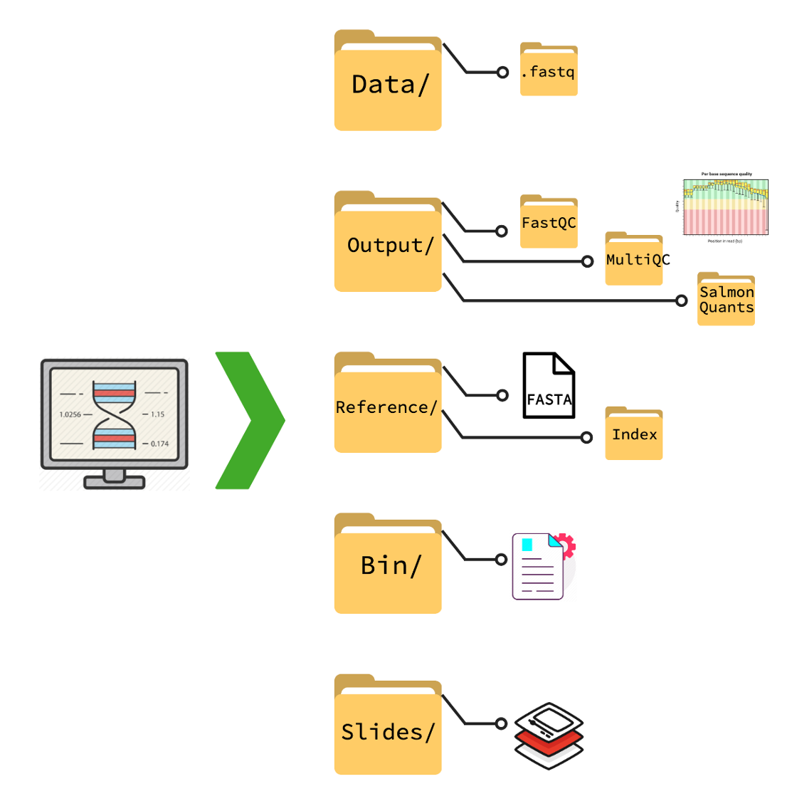
```

---
## Experimento

Número de acceso GEO: GSE152699

```{r, out.width="800px", fig.align='center', echo=F}
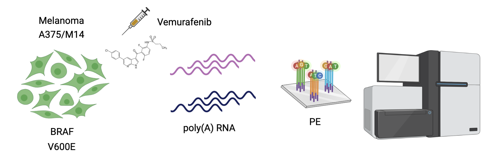
```

---

class: inverse, center, middle

# 3: Flujo de trabajo para el análisis de RNA-seq
---
## Flujo general de trabajo


```{r, out.width = "550px",fig.align='center'}
knitr::include_graphics("https://biocorecrg.github.io/RNAseq_course_2019/images/RNAseq_workflow.png")
```

.tiny[Imagen tomada de [aquí](https://biocorecrg.github.io/RNAseq_course_2019/salmon.html)]

---

## Primeros pasos


```{r, out.width = "540px",fig.align='center'}
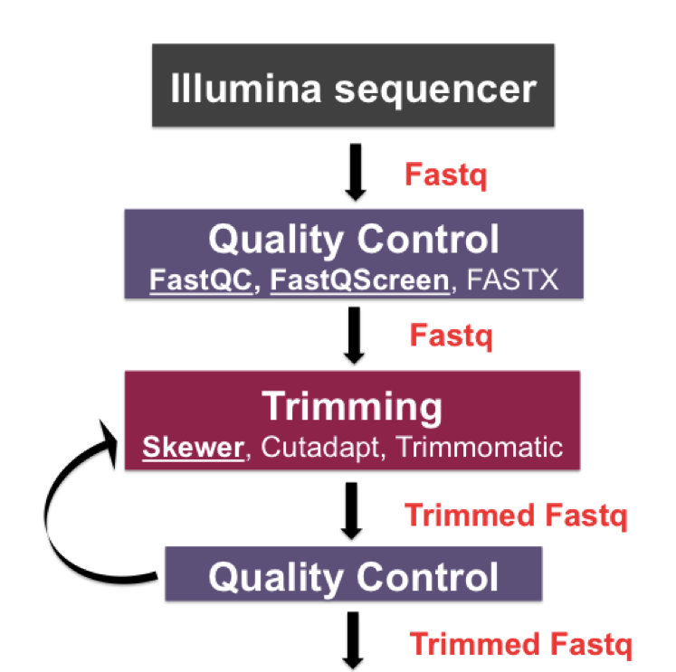
```


---

## Alineamiento y Quantificación


```{r, out.width = "950px",fig.align='center'}
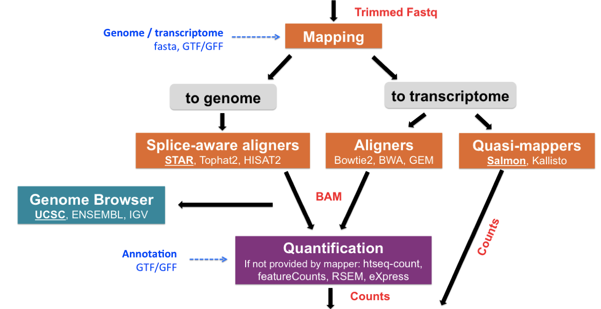
```


---

## Expresión Diferencial y análisis funcionales


```{r, out.width = "750px",fig.align='center'}
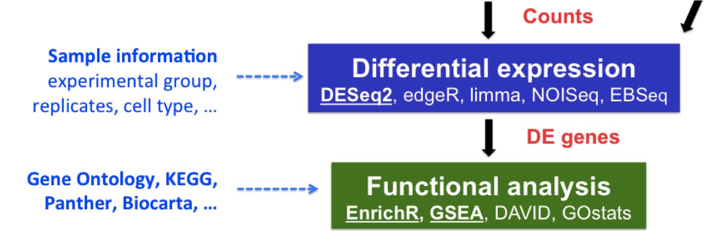
```

---

## Flujo general de trabajo


```{r, out.width = "550px",fig.align='center'}
knitr::include_graphics("https://biocorecrg.github.io/RNAseq_course_2019/images/RNAseq_workflow.png")
```

.tiny[Imagen tomada de [aquí](https://biocorecrg.github.io/RNAseq_course_2019/salmon.html)]

---

class: inverse, center, middle

# 4: Tipos de archivos 

---

## FastQ

--

- Derivado del formato FASTA

--

- Id secuencia + **Calidad**

--

- Generalmente no está comprimido (.fastq) > comprimir (.fastq.gz)

--

- Comprende 4 líneas por secuencia:
  * @ ID del read + información de la corrida
  * Secuencia 
  * Símbolo "+"
  * Calidad (Escala **Phred** y código **ASCII**)
  
---

## FastQ  
## Identificador

--

- El identificador de la secuencia es la primera línea del archivo .fastq

--

- Plataformas de Illumina superiores a 1.8 contienen la siguiente información:

--

**@machneID:run number:flowCell ID:lane:tile:read:control number:index**

```{bash echo = F}
gzcat ../Data/s1_R1.fastq.gz | head -n 1
```

---

## FastQ
## Calidad

La calidad de cada base secuenciada, en la escala **Phred**, se calcula de acuerdo la siguiente ecuación:

.full-width[.content-box-blue[$$Q = -10 * log10(p)$$]]
--

Q = Calidad 

--

p = Probabilidad de que el *base call* sea incorrecto

--

Valores de **p** cercanos a cero -> Alta calidad

---
## FastQ
## Calidad

```{r, out.width="700px", fig.align='center', echo = F}
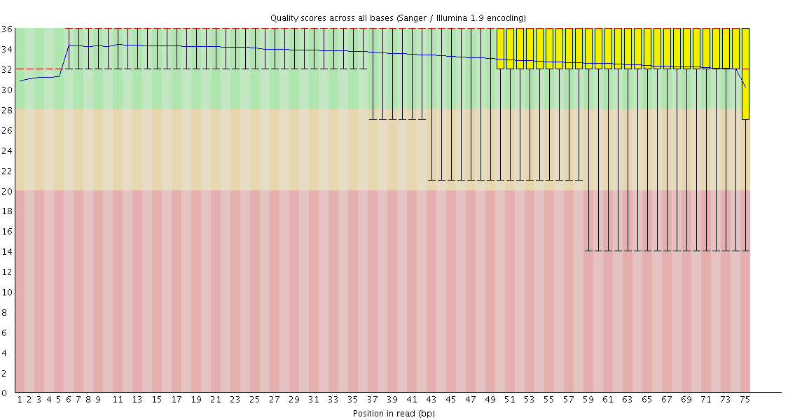
```


---
## FastQ
## Calidad

--

- Para evitar colocar los valores numéricos de la calidad en el archivo .fastq y saturarlo de información -> **[ASCII](https://www.ascii-code.com/)**

--

- Phred + 33 -> Plataformas de Illumina a partir de 1.8 (símbolos especiales + alfanuméricos)

--

- Phred + 64 -> Plataformas de Illumina anteriores a 1.8

---
## FastQ

```{r, out.width="600px", fig.align='center', echo = F}
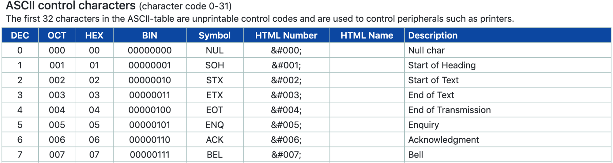
```


```{r, out.width="600px", fig.align='center', echo = F}
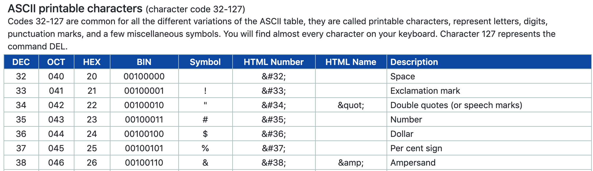
```

```{r, out.width="600px", fig.align='center', echo = F}
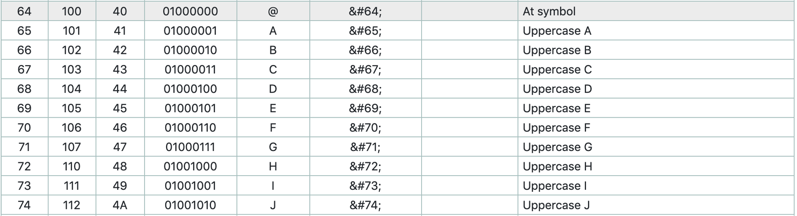
```

.font50[[ASCII Code - The extended ASCII table](https://www.ascii-code.com/)]
---

## FastQ


```{r, out.width="700px", fig.align='center',echo = F}
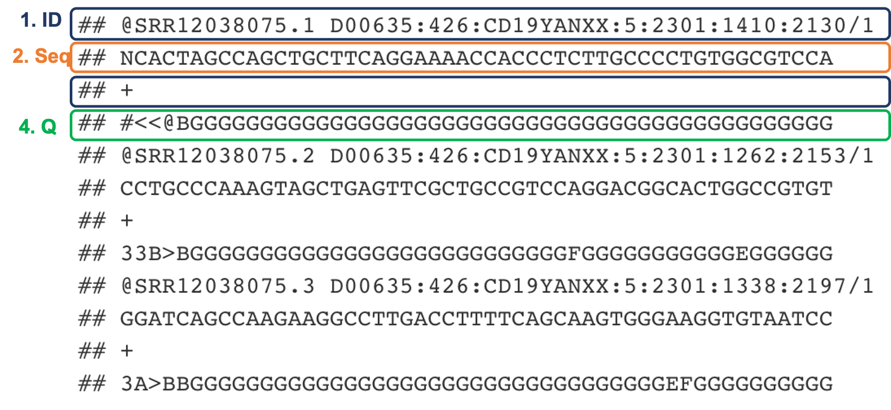
```


---
class: inverse, center, middle

# 5: Control de calidad de los datos
---
## ¿Porqué es importante revisar los datos crudos?
--

.full-width[.content-box-blue[Para verificar la calidad de los datos (*QC: quality control*)]]

--

- Los datos influencian los análisis posteriores

--

.pull-left[
```{r, out.width = "150px",fig.align='center'}
knitr::include_graphics("https://miro.medium.com/max/470/1*DVLpt3zCNaqeZOGNpgME7Q.png")
knitr::include_graphics("https://i.pinimg.com/originals/30/66/ac/3066ac69ae68ac200ace0ca8fe3882c3.jpg")
```
]

.pull-right[

```{r, out.width = "200px",fig.align='center'}
knitr::include_graphics("https://memegenerator.net/img/instances/68955295.jpg")
```

]


---

## FastQC

Usaremos el programa de [fastQC](https://www.bioinformatics.babraham.ac.uk/projects/download.html#fastqc) para checar la calidad de los datos.

--

Podemos usar la interfaz gráfica o la línea de comandos, en este caso usaremos la línea de comandos.

```{r, out.width = "400px",fig.align='center'}
knitr::include_graphics("https://www.bioinformatics.babraham.ac.uk/projects/fastqc/fastqc.png")
```

---
.center2[]
---

### Pasos para installar FastQC:
.scroll-output[
1- Descargar el programa de su página web [fastQC](https://www.bioinformatics.babraham.ac.uk/projects/download.html#fastqc)

2- Hacer el archivo ejecutable

```{bash echo=TRUE, eval = F}
# chmod 755 /Applications/FastQC.app/Contents/MacOS/fastqc
ls -l /Applications/FastQC.app/Contents/MacOS/fastqc
```

3- Crear una liga simbolica para ejecutar `fastqc` desde cualquier ubicación

```{bash echo=TRUE, eval=FALSE}
ln -s /Applications/FastQC.app/Contents/MacOS/fastqc /usr/local/bin/fastqc
```

4- Correr `fastqc`

```{bash, echo=TRUE, eval = F}
##Imprimir el manual del programa usando el flag help
fastqc --help
```
]

---

### Pasos para correr FastQC:

.scroll-output[

1- Checar los datos fastq
```{bash echo=TRUE, eval = F}
pwd
ls ../data/Archivos_fastq
```

2- Crear un directorio para guardar el output

```{bash echo=TRUE, eval=FALSE}
mkdir ../output/QC
```

3- Correr `FastQC`

```{bash echo=TRUE, eval=FALSE}
# la opción -o es para elegir el directorio de salida
fastqc ../data/Archivos_fastq/*.fastq.gz -o ../output/QC/
```

4- Checar los archivos generados

```{bash echo=TRUE, eval = F}
#Buscar los archivos generados por fastqc en el directorio de resultados
ls ../output/QC
```
]


---

## Buena calidad

El eje x = longitud de la read, y =  calidad (phred score)

Los datos a continuación muestran reads de buena calidad (Verde = buena, amarilla = aceptable, roja = baja). 

```{r, out.width = "400px",fig.align='center'}
knitr::include_graphics("https://gwu-omics2019.readthedocs.io/en/latest/_images/fastqc_good.png")
```


---

## Mala calidad

¿Hasta donde los datos son de buena calidad? ¿Estos datos los usarías?

```{r, out.width = "550px",fig.align='center'}
knitr::include_graphics("https://gwu-omics2019.readthedocs.io/en/latest/_images/fastqc_bad.png")
```


---

## Ejercicio

¿Cómo se ven nuestros datos? 


---
## MultiQC
.scroll-output[
[MultiQC](https://multiqc.info/) te permite juntar los output en un solo archivo y poder visualizarlos mejor.

*Esta parte es opcional, pero si trabajas con RNA-seq te puede intersar.


1. La instalación se hace con conda, así que primero activamos un ambiente conda

```{bash echo=TRUE, eval=FALSE}
conda activate base
pip install multiqc
```


2. Correr MultiQC

```{bash multiqc, echo=TRUE, eval=FALSE}
cd ../output/.
multiQC .
```

3. Checar el [output.html](file:///Users/user/Documents/Doctorado/Courses/Taught/minicurso_abr_2021/output/QC/multiqc_report.html#fastqc_per_base_sequence_content)


]
---
class: inverse, center, middle

# 6: Alineamiento
---

```{r, out.width="600px", fig.align='center', echo = F}
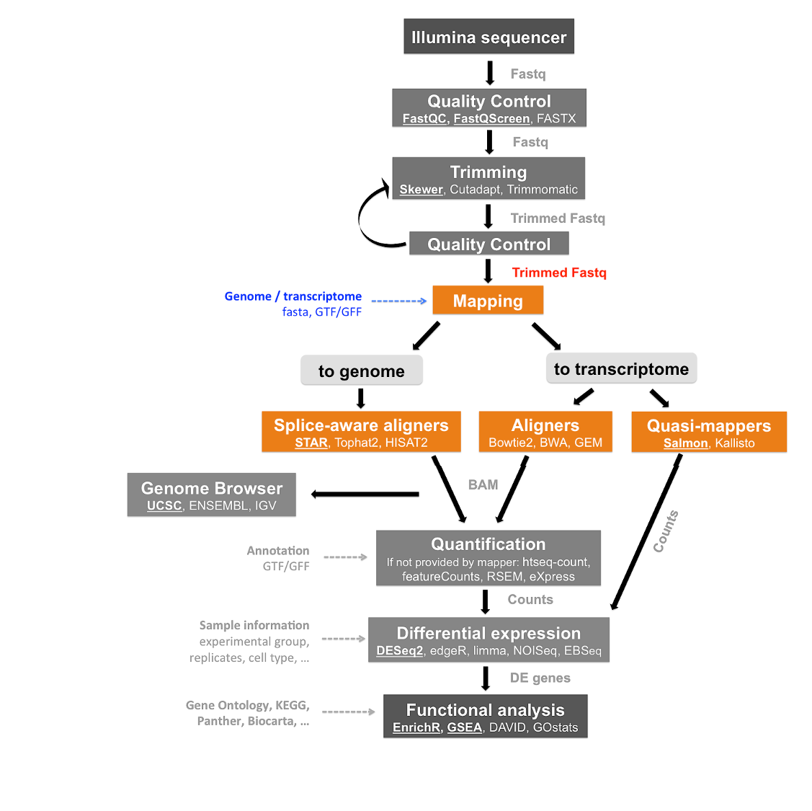
```

---

## Alineamiento
```{r, out.width="600px", fig.align='center', echo = F}
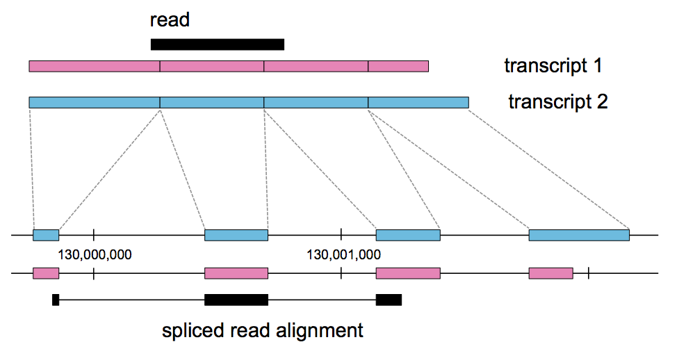
```
Buscar la región del genoma/transcriptoma a partir de la cual se originaron los reads

---

## Alineamiento

- Indexar genoma/transcriptoma (FASTA, GTF3/GFF3)
```{r, out.width="500px", fig.align='center', echo = F}
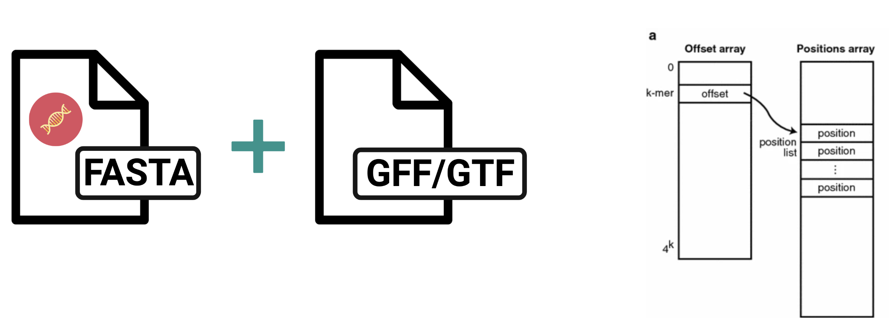
```

--
- Alinear los reads (Fastq) al genoma/transcriptoma indexado
```{r, out.width="500px", fig.align='center', echo = F}
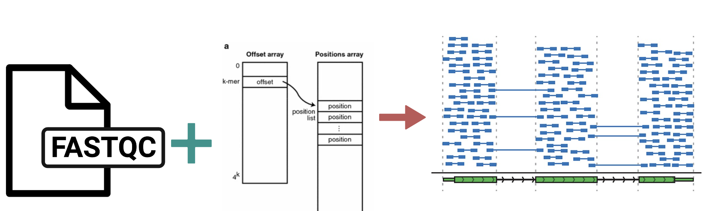
```
Imágenes tomadas de [aquí](https://almob.biomedcentral.com/articles/10.1186/s13015-016-0069-5/figures/1) y [aquí](https://figshare.com/articles/figure/_Comparison_of_stranded_and_unstranded_RNA_seq_library_methods_and_their_influence_on_interpretation_and_analysis_/1504417/1)
---

## Alineamiento
## Spliced reads 

```{r, out.width="600px", fig.align='center', echo = F}
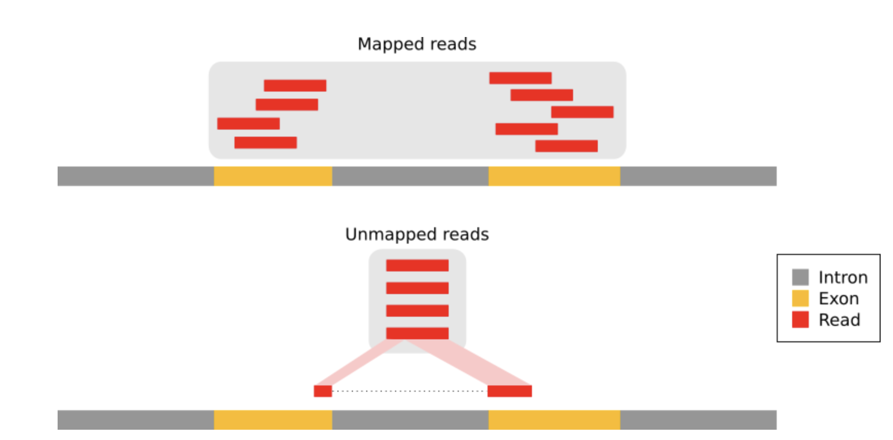
```

.font50[[HISAT: a fast spliced aligner with low memory requirements](https://www.nature.com/articles/nmeth.3317)]

---

## Splice aware

- TopHat 2
```{r, out.width="600px", fig.align='center',echo = F}
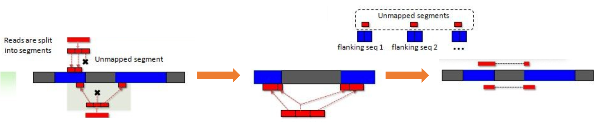
```

--
- HISAT
```{r, out.width="600px", fig.align='center', echo = F}
knitr::include_graphics("./Images/HISAT.png")
```

--
- STAR
```{r, out.width="400px", fig.align='center', echo = F}
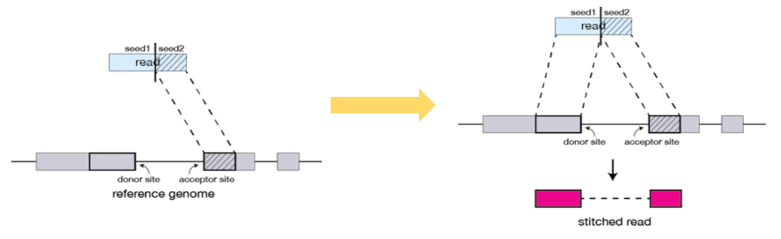
```

.font50[[Imágenes tomadas de aqui](https://training.galaxyproject.org/training-material/topics/transcriptomics/tutorials/rb-rnaseq/tutorial.html)]
---

## Alineamiento
## Pseudo-alineadores

Pseudo-alineadores (quasi-alineadores):

- Kallisto

- Sailfish

- **Salmon**

```{r}
knitr::include_graphics("https://combine-lab.github.io/salmon/images/SalmonLogo.png")
```

---

## Alineamiento
## Pseudo-alineadores

```{r, out.width="600px", fig.align='center', echo = F}
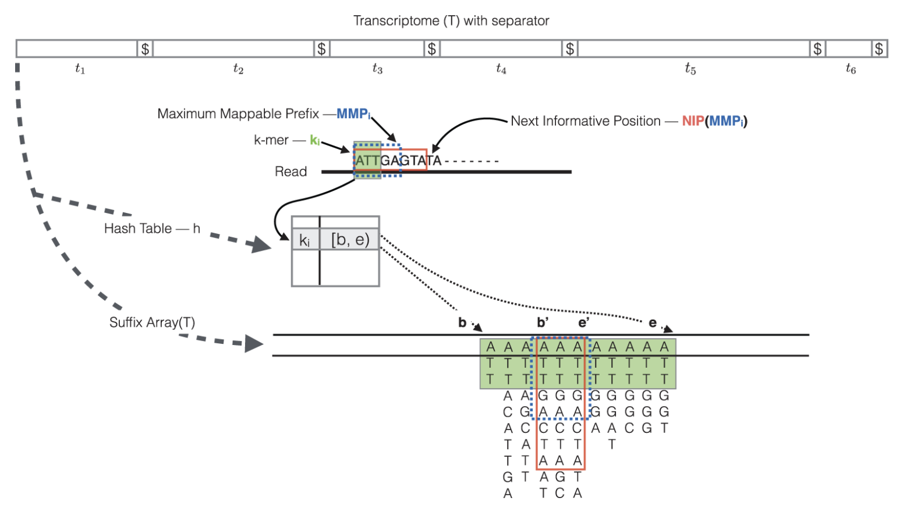
```

.font50[[RapMap: a rapid, sensitive and accurate tool for mapping RNA-seq reads to transcriptomes](https://academic.oup.com/bioinformatics/article/32/12/i192/2288985)]

---

## Alineamiento
## Pseudo-alineadores

```{r, out.width="500px", fig.align='center', echo = F}
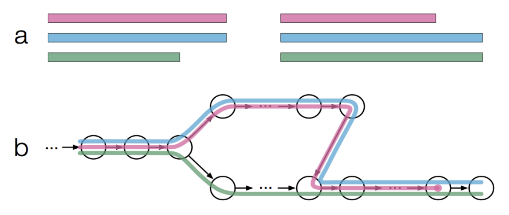
```

--
```{r, out.width="500px", fig.align='center', echo = F}
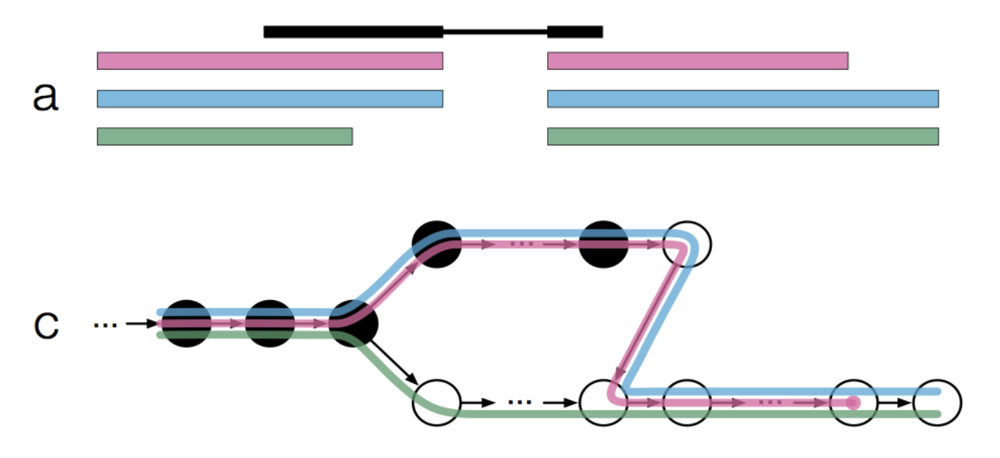
```

---

## Alineamiento
## Pseudo-alineadores

```{r, out.width="600px", fig.align='center', echo = F}
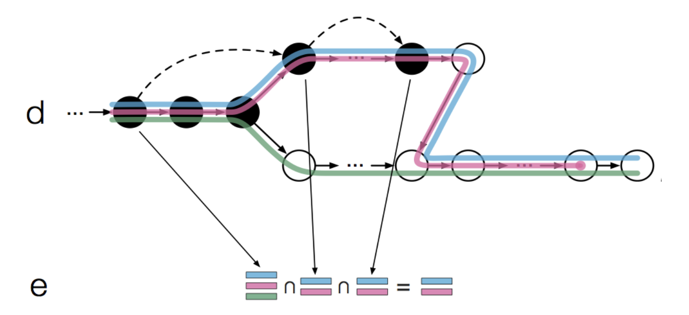
```

.font50[[Near-optimal probabilistic RNA-seq quantification](https://www.nature.com/articles/nbt.3519?WT.feed_name=subjects_genome-informatics)]

---
.center2[]

---
## Generar índice del transcriptoma
.scroll-output[
Para ello vamos a requerir:

- Archivo **Fasta** del transcriptoma de referencia del humano.

Descargado del sitio de [GeneCode](https://www.gencodegenes.org/human/)

Lo pueden encontrar en el folder de `Transcriptome/`


- Código para genear el índice

```
salmon index -t --genecode path_to_transcriptome.fa.gz -i path_to_save_index
```

`-t`: Ubicación al archivo Fasta del transcriptoma

`-i`: Ubicación para salvar el índice

`--genecode`: El Fasta del transcriptoma de referencia está en formato de GENECODE

]
---
## Cuantificar la abundancia de los transcritos
.scroll-output[
Requerimientos:

- Archivos **Fastq** de las lecturas -> Paired end R1 y R2

Ubicados en el folder de `data`

- Índice generado en el paso anterior

- Código para producir cuantificar los transcritos

```
salmon quant -i path_to_index 
             -l A -1 path_to_R1 -2 path_to_R2 
             -o path_to_store_results
```
`-i`: Ubicación del índice

`-l`: Tipo de librería

`-1 y -2`: Ubicación a las lecturas R1 y R2

`-o`: Ubicación para almacenar los resultados


```{bash engine.opts = '-l', eval = F, echo = T}
##Crear un directorio para almacenar los datos de los conteos
mkdir -p ../salmon_quant
##Llamar salmon para realizar el conteo
salmon quant -i ../transcriptome/genecode.v37.salmon141 \
             -l A \
             -1 ../Data/s1_R1.fastq.gz -2 ../Data/s1_R2.fastq.gz \
             -p 6 --validateMappings \
             -o ../salmon_quant/s1_quant
```

]
---

class: inverse, center, middle

# 7: Tximeta y Tximport
---
## Recordatorio

¿Dónde estamos?

```{r, out.width = "450px",fig.align='center'}
knitr::include_graphics("https://biocorecrg.github.io/RNAseq_course_2019/images/RNAseq_workflow.png")
```

.tiny[Imagen tomada de [aquí](https://biocorecrg.github.io/RNAseq_course_2019/salmon.html)]


---

## Recordatorio

¿Dónde estamos?

```{r, out.width = "450px",fig.align='center'}
knitr::include_graphics("Images/worflowTximeta.png")
```
 
.tiny[Imagen tomada de [aquí](https://biocorecrg.github.io/RNAseq_course_2019/salmon.html)]

---

## Tximeta

Paquetería que conserva 

```{r, out.width = "650px",fig.align='center'}
knitr::include_graphics("https://journals.plos.org/ploscompbiol/article/figure/image?size=large&id=10.1371/journal.pcbi.1007664.g001")
```
 

.tiny[[Love, Michael I., et al. "Tximeta: Reference sequence checksums for provenance identification in RNA-seq." PLoS computational biology 16.2 (2020): e1007664.](https://journals.plos.org/ploscompbiol/article?id=10.1371/journal.pcbi.1007664)]


---

## Importar datos


Utilizamos `tximeta` para importar los datos. 

.content-box-red[

Nota: `tximeta` espera dos columnas:

  - `files`: con la rut a `quant.sf`
  
  - `names`: con los nombres de las muestras
]

---

.center2[]
---

## Importar datos

.scroll-output[
Importamos la información de cada muestra

```{r, echo=TRUE, eval = T}
##Leemos los datos
coldata <- read.delim(here::here("output/salmon_quants/metadata.txt"))
##Generamos la columna "names"
coldata <- coldata %>% dplyr::rename(names = unique_id)
coldata
##Ahora las cuentas generadas por `Salmon`, para ello 
##Ubicamos el dir de trabajo
dir <- file.path(here::here("output/salmon_quants"))
##Verificar que estén los directorios  
list.files(dir) 
##¿¿Que hacemos aqui?? Verificar que el path se generó correctamente
#file.path(dir,paste0(info$Sample,"_quant"),"quant.sf")
coldata$files <- file.path(dir,paste0(coldata$Sample,"_quant"),"quant.sf")
##Corroboramos que los archivos existan
data.frame(coldata$Sample, file.exists(coldata$files))
```

Importar los datos usando `tximeta` 

```{r echo=TRUE, eval = F}
#BiocManager::install("tximeta")
library("tximeta")
se <- tximeta(coldata)
```

]

---
class: inverse, center, middle

# 8: Objeto Summarized Experiment
---

.center2[
```{r, out.width="700px", echo=FALSE}
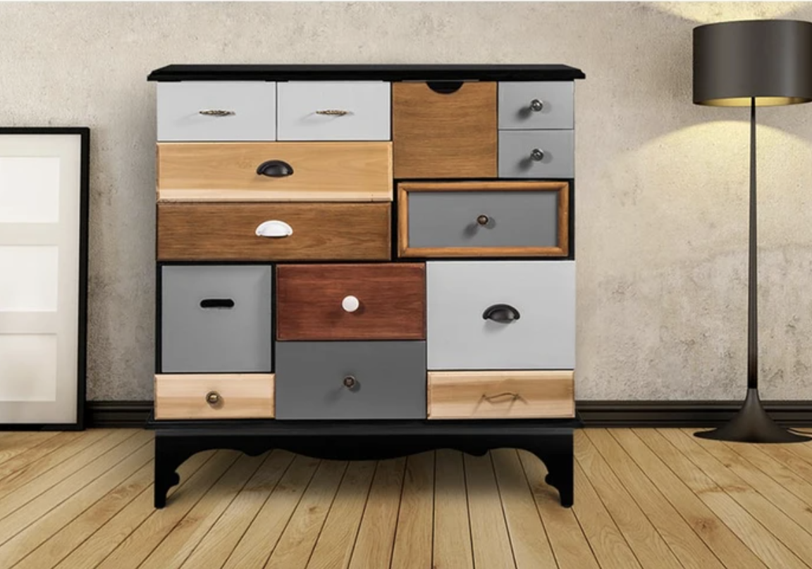
```
]
---

## Summarized Experiment

```{r, out.width="400px", fig.align='center',echo = FALSE}
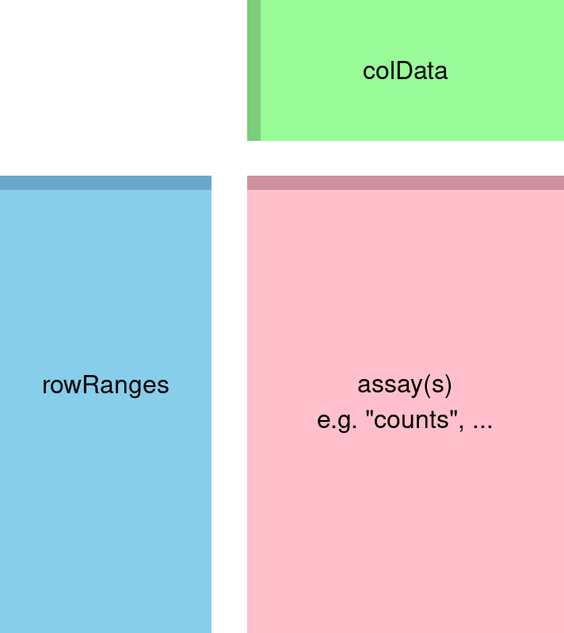
```

---
## Summarized Experiment

```{r, out.width="400px", fig.align='center', echo = F}
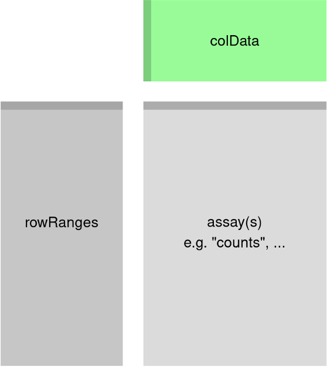
```

---

## Summarized Experiment
## ColData

.scroll-output[
- El cajón o slot correspondiente a `ColData` contiene la tabla de metadatos `coldata` creada para importar las cuentas con tximeta


- Para acceder a **.red[ColData]** usar el siguiente comando:

```{r, echo = TRUE}
colData(se)
```
]

---

## Summarized Experiment
## ColData

- El slot **ColData** es un objeto con clase de *DataFrame*
.code70[
```{r, echo = T}
class(colData(se))
```
]
--

- *Rownames* de **ColData** corresponden a los *Colnames* en el slot **Assay**- **.red[Importante para análisis con DESeq2]**
.code70[
```{r, echo = T}
rownames(colData(se))
```
]

---

## Summarized experiment

```{r, out.width="400px", fig.align='center', echo = F}
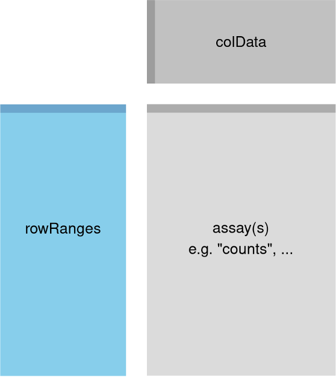
```

---
## Summarized experiment
## rowRanges

.scroll-output[
- El cajón de `rowRanges` hace referencia a las coordenadas de cada transcrito


- Para acceder al **.red[rowRanges]** usar:

```{r, echo = T}
rowRanges(se)
```

]
---

## Summarized experiment

```{r, out.width="400px", fig.align='center', echo = F}
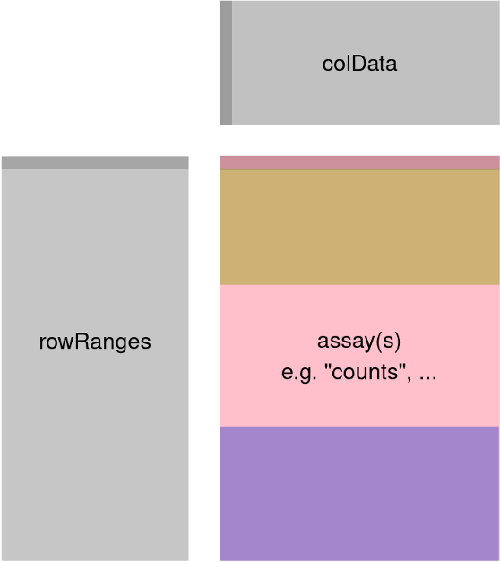
```

---
## Summarized experiment
## Assay

.scroll-output[
- El slot `assay` almacena la información de las cuentas para cada transcrito dividida en tres niveles:

```{r, echo = T}
assayNames(se)
```

- Para acceder a la matriz de cuentas estimadas por *Salmon*, correr:

```{r, echo = T}
head(assay(se), 5)
```

]
---
## Summarized experiment
## Assay
- Las matriz de abundancia *(TPM)* puede obtenerse:

.code70[
```{r, echo = T}
## Obtener matriz de TPM
head(se@assays@data$abundance, 5)
```
]

---
## Summarized experiment

.scroll-output[
¿Recuerdan a qué tiene que ser igual *Rownames* del slot colData?


.code90[
```{r, echo = T}
rownames(colData(se))
```

```{r, echo=T}
colnames(assay(se))
```

```{r, echo = T}
## Comprobar que rownames de colData es igual a colnames de assay
row.names(colData(se)) == colnames(assay(se))
```

]
]
---
class: inverse, center, middle

# 9: Normalización de los datos
---
## Normalización 


Es el primer paso del análisis de expresión diferencial y es necesario para hacer comparaciones acertadas entre muestras. 

--

Las cuentas crudas están conformadas por un componente "interesante" (la expresión de RNA) y componentes "no interesantes" (como los batch effects, ruido de la plataforma, etc.).

--

La normalzación escala las cuentas para tratar de reducir los componentes "no interesantes" y poder comparar las muestras entre si. 

---

## Criteríos para normalizar

Se puede normalizar considerando:

- La profundidad (tamaño de librería)

```{r, out.width = "450px",fig.align='center'}
knitr::include_graphics("https://hbctraining.github.io/DGE_workshop/img/normalization_methods_depth.png")
```

---

## Criteríos para normalizar

Se puede normalizar considerando:

- El tamaño del gen

```{r, out.width = "450px",fig.align='center'}
knitr::include_graphics("https://hbctraining.github.io/DGE_workshop/img/normalization_methods_length.png")
```


---

## Criteríos para normalizar

Se puede normalizar considerando:

- Composición de RNA

```{r, out.width = "350px",fig.align='center'}
knitr::include_graphics("https://hbctraining.github.io/DGE_workshop/img/normalization_methods_composition.png")
```


.tiny[Imagen tomada de [aquí](https://biocorecrg.github.io/RNAseq_course_2019/salmon.html)]


---
## Métodos comunes

.scroll-output[

| Método de normalización | Descripción | Factores de evaluación | Recomendaciones de uso |
|:-----------------------------------------------------------------------------------:|:----------------------------------------------------------------------------------------------------------------------------:|:--------------------------------------------------:|:-------------------------------------------------------------------------------------------------------------------:|
| CPM (cuentas por millón): cuentas escalados por el número total de lecturas | profundidad de secuenciación | comparaciones de cuentas de genes entre réplicas del mismo grupo de muestras| NO para comparaciones dentro de la muestra o análisis de DE.| 
| TPM (transcritos por kilobase por millón de lecturas): cuentas por longitud de transcripción (kb) por millón de lecturas mapeadas | profundidad de secuenciación y longitud de genes| comparaciones de cuentas de genes dentro de una muestra o entre muestras del mismo grupo de muestras| NO para análisis de DE. |
| RPKM/FPKM (lecturas/fragmentos por kilobase de exón por millón de lecturas/fragmentos mapeados| similar a TPM, profundidad de secuenciación y longitud del gen | comparaciones de cuentas entre genes dentro de una muestra | NO para comparaciones entre muestras o análisis de DE.|
| Mediana de ratios de DESeq2 | cuentas divididas por factores de tamaño específicos de la muestra determinados por la mediana del ratio de cuentas de genes en relación con la media geométrica por gen | profundidad de secuenciación y composición del RNA | comparaciones de cuentas de genes entre muestras y para el análisis de DE; NO para comparaciones dentro de la muestra |
| La media cortada de los valores M de EdgeR (TMM) | utiliza una media recortada ponderada de los ratios de expresión logarítmica entre las muestras | profundidad de secuenciación | composición de RNA y longitud de los genes. |

.tiny[

[Tabla tomada de Intro to DGE](https://hbctraining.github.io/DGE_workshop/lessons/02_DGE_count_normalization.html#:~:text=Normalization%20is%20the%20process%20of,between%20and%2For%20within%20samples.)
]

]

---
## DESeq2

- Normalización para análisis de expresión diferencial:

  - Factor de normalización de `DESeq2`

- Normalización para visualización u otras aplicaciones:

  - Variance stabilizing transformation (VST)
  
  - Regularized-logarithm transformation (rlog)

---
## DESeq2

.scroll-output[

`DESeq2`ajusta a un modelo lineal generalizado (GLM) de la familia binomial negativa (NB).

```{r include=FALSE}
library(tidyverse)
```


```{r}
# tabla con cuentas 
df <- tibble(gene = c("gene1", "gene2"),
                 muestraA = c(1749, 35),
                 muestraB = c(943, 29)
                 )
df
```

1. Crea una pseudo-referencia por muestra (promedio geometrico por fila) `sqrt(muestraA * muestra B)`
```{r}
# Calcular el promedio geometrico
df <- df %>%
  rowwise() %>% 
  mutate(prom_geom = sqrt(muestraA * muestraB))
df
```

2. Se calcula la fración `muestra/pseudo-referencia`
```{r}
# Dividir las cuentas entre el promedio geometrico
df <- df %>% 
  rowwise() %>% 
  mutate(muestraA_pseudo_ref = muestraA / prom_geom) %>% 
  mutate(muestraB_pseudo_ref = muestraB / prom_geom)
df
```

3. Se calcula un factor de normalización (size factor) utilizando la `mediana` por columnas.
```{r}
# Se calcula el factor de normalizacion usando la mediana para cada muestra
norm_factor_muestraA <- median(df$muestraA_pseudo_ref)
norm_factor_muestraA

# Repetimos el proceso para la muestra B
norm_factor_muestraB <- median(df$muestraB_pseudo_ref)
norm_factor_muestraB

```

4. Se dividen las `cuentas crudas/size factor` para calcular las cuentas normalizadas.
```{r}
# Columnas con las cuentas crudas
df %>% 
  select(gene, muestraA, muestraB)

# Dividir las cuentras entre el factor de normalización
df$norm_muestraA <- df$muestraA/norm_factor_muestraA
df$norm_muestraB <- df$muestraB/norm_factor_muestraB

# Columnas con las cuentas normalizadas
df %>%  
  select(norm_muestraA, norm_muestraB)
```


]
---

.center2[]
---

## Ejercicio 

.scroll-output[

Se pueden ocupar otras transformaciones en la paquetería de `DESeq2` pero no son las mas recomendadas para DE. 

Para normalizar, primero construimos el objeto `DESeqDataSet`, para ello necesitamos definir el modelo de DE (Quienes son Controles y quienes tratamiento). 


```{r echo=TRUE, message=FALSE, warning=FALSE}
# Importamos las librerías que necesitemos
library("DESeq2")
library("dplyr")
library("ggplot2")
library("vsn")
```

```{r echo=TRUE, eval = F}
# Definir los grupos que se desean comparar
se$Condition <- factor(se$Condition)

# Checar cantidad de muestras
table(se$Condition)

# Generar el objeto de DESeq 
dds <- DESeqDataSet(se, design = ~ Condition)

# Funcion que normaliza los datos y realiza el analisis de expresión differencial
dds <- DESeq(dds)
```

]


---

## Otras transformaciones

.scroll-output[

Puedes realizar otras transformaciones en `DESeq2` para estabilizar la varianza a través de los differentes valores promedio de expresión.  

```{r, dpi=300}
# Grafica de cuentas crudas
meanSdPlot(counts(dds), ranks = F)

# Gráfica de cuentas en escala log2
meanSdPlot(log2(counts(dds) +1), ranks = F)
```


```{r echo=TRUE, dpi=300}
# variance stabilizing transformation (VST), (Anders and Huber 2010)
vsd <- vst(dds, blind = FALSE)
head(assay(vsd), 3)

# regularized-logarithm transformation (rlog), (Love, Huber, and Anders 2014)
rld <- rlog(dds, blind = FALSE)
head(assay(rld), 3)

# Normalización con el factor de normalizacion 
dds <- estimateSizeFactors(dds)

# Juntar los datos de las tres normalizaciones
df <- bind_rows(
  as_data_frame(log2(counts(dds, normalized=TRUE)[, 1:2]+1)) %>%
         mutate(transformation = "log2(x + 1)"),
  as_data_frame(assay(vsd)[, 1:2]) %>% mutate(transformation = "vst"),
  as_data_frame(assay(rld)[, 1:2]) %>% mutate(transformation = "rlog"))
  
# Renombrar columnas
colnames(df)[1:2] <- c("x", "y")  

# Nombre de las graficas
lvls <- c("log2(x + 1)", "vst", "rlog")

# Agrupar los tres tipos de normalizacion en grupos como factores
df$transformation <- factor(df$transformation, levels=lvls)

# Plotear los datos
ggplot(df, aes(x = x, y = y)) + geom_hex(bins = 80) +
  coord_fixed() + facet_grid( . ~ transformation)  
 
```


]

---
class: inverse, center, middle

# 10: Exploración de los datos
---


.center2[
```{r, out.width="700px", echo = F}
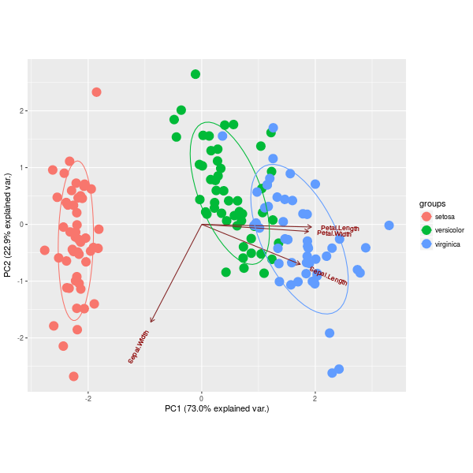
```
]

---
## Exploración de datos
## ¿Por qué es importante explorar los datos?

--

- Paso previo al análisis de expresión diferencial

--

- Análisis de calidad de los datos

--

- Permite conocer la congurencian entre individuos o réplicas 

--

- Mediante gráficos, visualizar comportamiento de los datos -> Outliers

---
## Exploración de datos

.pull-left[
```{r, out.width="400px", echo = F}
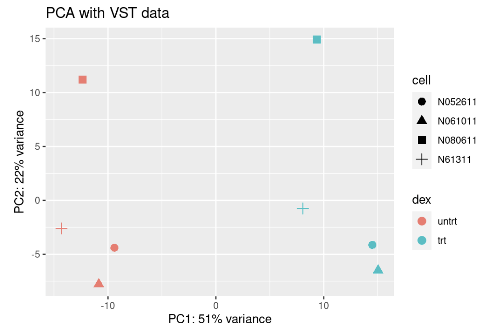
```

]
--
.pull-right[
```{r, out.width="400px", echo = F}
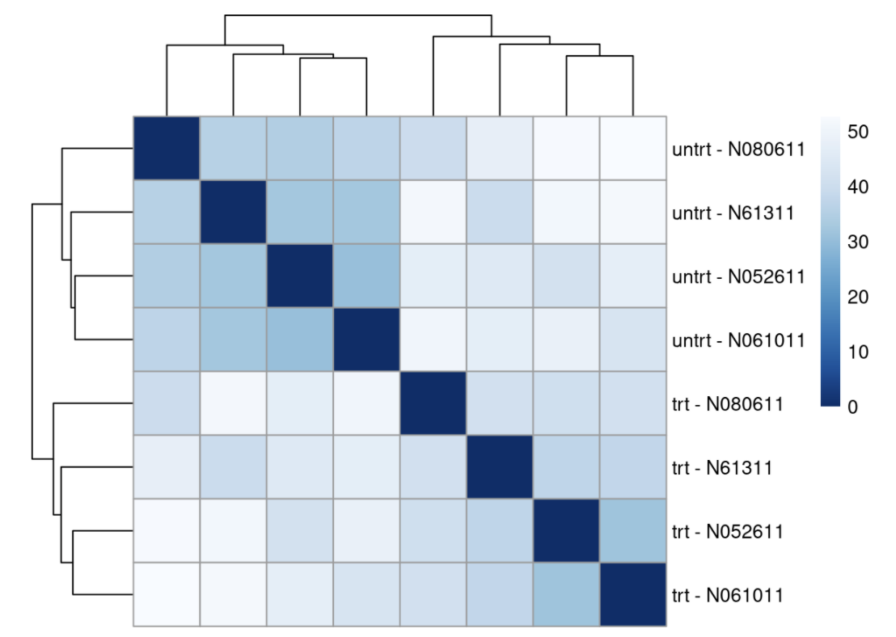
```

]

---
## Exploración de datos

.pull-left[
```{r, out.width="400px", echo = F}

```
**.red[PCA]**
]

.pull-right[
```{r, out.width="400px", echo = F}

```
**.red[Heatmap]**
]

---
## PCA

--

- Análisis de componentes principales

--

- Método algebraico para reducir la dimensionalidad de sets de datos complejos (múltiples variables)

--

- Reducción de dimensionalidad o variables permite un análisis exploratorio más intuitivo

--

.content-box-red[Reducción de variables implica  preservar y captar la mayor información sobre los datos
]

---
## PCA
## Normalización de los datos
--

```{r, out.width="350px", fig.align='center', echo = F}
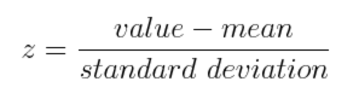
```

Escalación de los datos -> Normalización para hacerlos más comparables

--

```{r, out.width="350px", fig.align='center', echo = F}
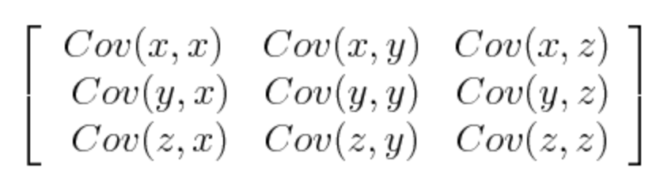
```

Busqueda de correlación entre las variables -> correlación positiva o negativa

---
## PCA

.center[

]

--
.content-box-red[Los componentes principales son los nuevos ejes que maximizan la distancia de los datos al origen
]

---
## PCA
## Componentes principales

--

- El .green[primer componente] es aquel en el que los datos presentan la mayor separación (variación)

--

- El .orange[segundo componente] es el que tiene la segunda mayor separación entre los datos y es perpendicular al primer componente

--

- ¿Cuantos componentes existen? -> tantas variables en el set de datos


---
## PCA
## Componentes principales

- Cada componente principal tiene asociado un eigenvector (vector unitario) y un eigenvalue (cantidad escalar)

--

- Los eigenvalues son la suma del cuadrado de las distancias de los puntos proyectados sobre dicho componente principal

--

- Los eigenvalues permiten seleccionar cuál es el componente principal que explica la mayor variación en los datos

---
## PCA

```{r, out.width="450px", fig.align='center', echo = F}
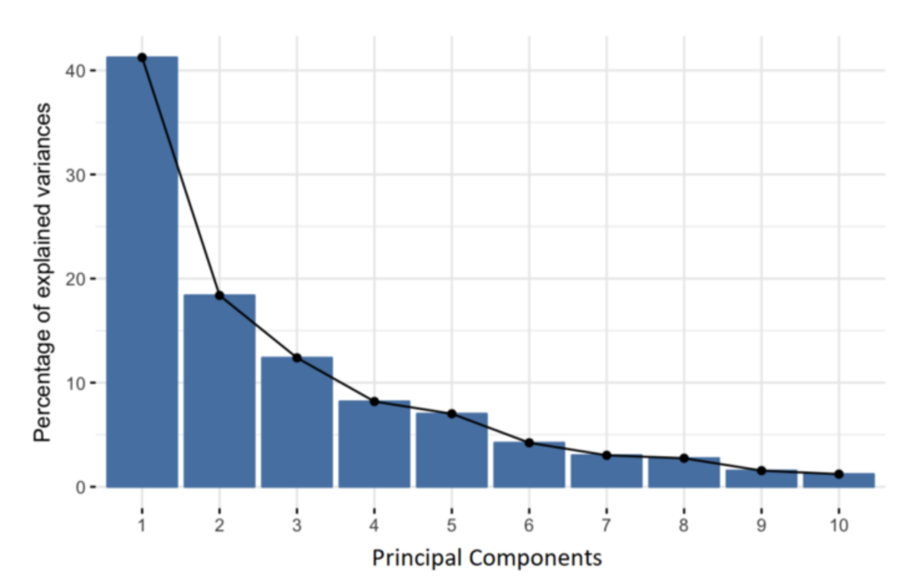
```
Screeplot


---
## PCA

- En sets de datos de RNAseq, el PCA permite visualizar la distancia o congruencia de los datos

--

- Generalmente son gráficas de puntos (muestras) en dos dimensiones (dos componentes) que resumen las principales fuentes de varianza

--
.center[
```{r, out.width="400px", echo = F}
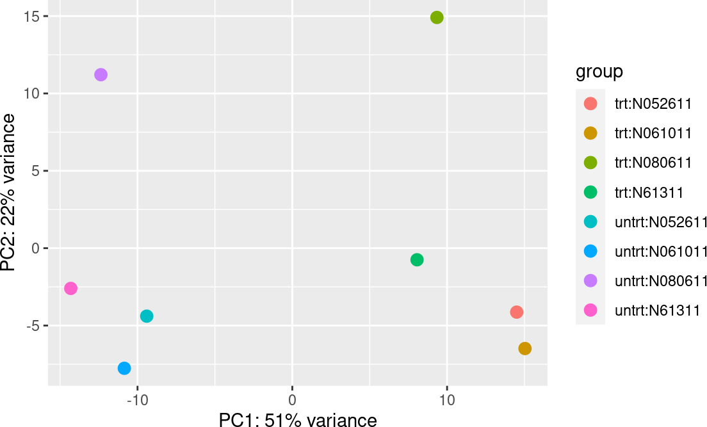
```
]

---
## ¿Cómo crear nuestro propio PCA?

.scroll-output[
Primero instalen las siguientes librerías:

```{r, eval = F, echo = T}
library(DESeq2)
library(PCAtools)
```

Usemos la siguiente normalización logarítmica de las cuentas (toma en cuenta el tamaño de la librería)

```{r, eval = F, echo = T}
## Transformación recomendada para sets de con menos de 30 muestras
rld <- rlog(dds, blind = F)
```

Si tuvieramos un número mayor de muestras (n > 30) entonces conviene:

```{r, eval = F, echo = T}
vsd <- vst(dds, blind = T)
```
]

---
## PCA
.scroll-output[
- Usemos la función interna de *DESeq2* para graficar nuestro PCA:

```{r, eval = FALSE, echo = T}
## El argumento intgroup permite especificar mediante cuál variable colorear los datos
plotPCA(rld, intgroup = "Condition")
```


**DESeq2 evalúa los 500 genes con mayor varianza del set de datos**


- Con la librería de *PCAtools*:

```{r, eval = F, echo = T}
## Crear un objeto que contenga los datos del PCA
PCA <- pca(assay(rld), scale = T, metadata = coldata) 
## Graficar en 2D los resultados
biplot(PCA, colby = "Treatment")
## Generar un screeplot para visualizar la varianza asociada a cada componente
screeplot(PCA)
```

]
---

.center2[
]

---
## PCA
## ¿Cómo ven los resultados?
```{r, echo = F, include = F}
ggplot()+
  theme_set(theme_bw())
```

--

.pull-left[**DESeq2**
```{r,echo = F,dpi=300, out.width= "350px", fig.align='center'}
plotPCA(rld, intgroup = "Condition")+
  geom_label_repel(aes(label = colnames(assay(rld))), 
                   segment.color = "grey50", 
                   box.padding = 0.35, 
                   point.padding = 0.5)
```
]
--
.pull-right[**PCA tools**
```{r, echo = F, dpi=300, out.width="350px", fig.align='center'}
biplot(PCA, lab = colnames(assay(rld)), colby = "Treatment", legendPosition = "right")
```
]

---
## PCA
## ¿Cuánta varianza es explicada por cada componente?

```{r, dpi=300,out.width="400px", fig.align='center', echo = F, warning=FALSE}
screeplot(PCA)
```

---
## PCA y MDS
.scroll-output[
Generemos un MDS plot interactivo con los datos. Para ello usemos la librería de *Glimma* y la función de `GlimmaMDS`

```{r, eval = F, echo = T}
glimmaMDS(dds)
```
]

---
class: inverse, center, middle

# 13: Análisis de expresión diferencial
---
## Análisis de expresión diferencial (DE)

Paso para obtener cuáles son los genes que varían entre las condiciones

```{r, out.width = "750px",fig.align='center'}
knitr::include_graphics("https://raw.githubusercontent.com/hbctraining/DGE_workshop/master/img/de_theory.png")
```

---

## Pasos en el DE

```{r, out.width = "350px",fig.align='center'}
knitr::include_graphics("https://github.com/hbctraining/DGE_workshop/raw/master/img/deseq2_workflow_separate.png")
```

---
## Dispersión

La dispersión es una medida de la variabilidad de los datos como (varianza, sd, etc.). En `DESeq2` se utiliza `α`:

$$ \alpha \propto 1/mean $$ 
$$ \alpha \propto variance $$ 

Así que **La dispersión es mayor para cuentas más bajas y menor para cuenas más altas**. 

Y la **dispersión refleja la varianza**.

.full-width[.content-box-red[
`DESeq2` asume que los genes con similar expresión tienen similar dispersión
]]

---

## Ajustando la dispersión


```{r, out.width = "450px",fig.align='center'}
knitr::include_graphics("https://github.com/hbctraining/DGE_workshop/raw/master/img/deseq_dispersion1.png")
```


---

## Reduciendo la dispersión

```{r, out.width = "750px",fig.align='center'}
knitr::include_graphics("https://github.com/hbctraining/DGE_workshop/raw/master/img/deseq_dispersion2.png")
```


---

.center2[]
---

## Ejercicio

.scroll-output[

La librería de `DESeq2` normaliza y realiza el análisis de expresión diferencial en una sola función. Así que ya realizamos el análisis, vamos a verlo:

```{r include=FALSE, eval = F}
#Cambio
#info <- read.delim(here::here("output/salmon_quants/metadata.txt"))
#info$names <- info$Unique_id
#dir <- file.path(here::here("output/salmon_quants"))
#info$files <- file.path(dir,paste0(info$Sample,"_quant"),"quant.sf")
#library("tximeta")
#gse <- tximeta(info)
```


```{r echo=TRUE, message=FALSE, warning=FALSE}
library("DESeq2")
library("dplyr")
library("ggplot2")
```

```{r echo=TRUE, eval = F, include=F}
#
se$Condition <- factor(se$Condition)
table(se$Condition)
dds <- DESeqDataSet(se, design = ~ Condition)
dds <- DESeq(dds)
```

Para ver los resultados podemos usar la función `results`

```{r, eval = T, echo = T}
res <- results(dds)
res
summary(res)
```

Para ver que hay en cada columna:
```{r, eval = T, echo=T}
mcols(res, use.names = TRUE)
```

Podemos hacer cortes:
```{r, eval = T, echo = T}
resLFC1 <- results(dds, lfcThreshold=1)
table(resLFC1$padj < 0.1)
```
]

---
class: inverse, center, middle

# 14: Visualización de los resultados
---

.center[
### ¿Cuántos tipos de gráficos conoces para visualizar resultados del análisis DE?
]

.pull-left[
```{r, out.width="350px", echo = F}
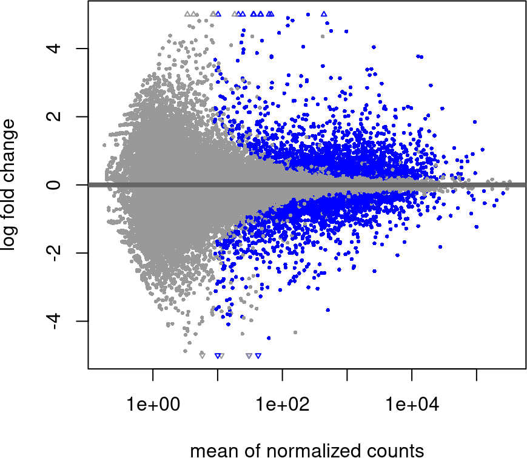
```
]

.pull-right[
```{r, out.width="350px", echo = F}
knitr::include_graphics("./Images/Volcanoplot.png")
```
]

---
.center[
### ¿Cuántos tipos de gráficos conoces para visualizar resultados del análisis DE?
]

.pull-left[
```{r, out.width="350px", echo = F}

```
**.green[MAplot]**
]

.pull-right[
```{r, out.width="350px", echo = F}
knitr::include_graphics("./Images/Volcanoplot.png")
```
**.green[Volcano plot]**
]

---
# MAplot
.scroll-output[
Gráfico que representa la distribución de los genes o transcritos en las comparaciones de interés

**M** eje y de *minus*:

.content-box-blue[$$logTx - logCT = logTx/CT$$
]

**A** eje x de *average* -> Promedio de las cuentas normalizadas para cada gen en todas las muestras

Para generar el **MAplot** usemos el siguiente comando:

.code90[
```{r, eval = F, echo = T}
##Es importante que recuerden que la hipótesis nula que se probó fue
##"El lfc del gen n es igual a 0" por lo tanto los genes coloreados son...
plotMA(res)
```
]
]
---
# MAplot

```{r, echo = F, dpi=200, out.width="450px", fig.align='center'}
plotMA(res)
```

---
# MAplot

Para tener una mejor estimación del LFC de genes que:

- Son poco abundantes

- Tienen alta dispersión

Usemos la función `lfcShrink` de la librería *.red[apeglm]*


```{r, eval = F, echo = T}
##En el argumento coef indicar el contraste entre los grupos experimentales
res_lfc <- lfcShrink(dds, coef = "Condition_Verafinib_vs_Control",  type = "apeglm")
##Si desconocemos el nombre del contraste, usar:
resultsNames(dds)
```


---
# MAplot

.pull-left[
Sin `lfcshrink` 

```{r, echo = F, dpi=200, out.width="450px", fig.align='center'}
plotMA(res)
```
]

.pull-right[
Con `lfcshrink` 

```{r, echo = F, dpi=200, out.width="450px", fig.align='center'}
plotMA(res_lfc)
```
]
---
# MAplot
.scroll-output[
También pueden generar un MAplot interactivo con la librería de *Glimma*
```{r, eval = F, echo = T}
##Para los objetos creados con DESeq2 es importante que incluyas un nivel llamado group
group <- info$Treatment
dds$group <- group
glimmaMA(dds)
```
]
---
# Volcano plot

De manera similar al MAplot con el volcano plot visualizamos los genes que muestran expresión diferencial en nuestra condición de interés

- En el eje y se grafica el -log10 de padj

- En el eje x se grafica el lfc o *log2foldchange*

.code80[
```{r, eval = F, echo = T}
##Para crear un volcano plot necesitas convertir los resultados de DESeq a un data frame
DEG <- as.data.frame(res)
##En el script de funciones encontrarás la función de volcanoplotR para generar tu gráfico
#los valores de los argumentos logfc y p.adj deben ser iguales al threshold utilizado para generar los resultados
#en type debes indicar que los resultados provienen de DESeq
volcanoplotR(DEG, logfc = 0, p.adj = 0.1, type = "DESeq")
```
]

---
# Volcano plot

```{r, echo = F, dpi=200, out.width="450px", fig.align='center'}
volcanoplotR(DEG, logfc = 0, p.adj = 0.1, type = "DESeq")
```

---

# Heatmap

El *heatmap* nos permite visualizar la expresión de los genes diferencialmente expresados en terminos de las cuentas normalizadas

Consideraciones:

- Usar los valores de las cuentas normalizadas para una mejor comparación entre muestras

- Escalar los valores de las cuentas (renglones) para visualizar las diferencias en la expresión

Usaremos la librería de *.red[pheatmap]*

---
# Heatmap

.code90[
```{r, eval = F, echo=T}
##Guardar la lista de transcritos que mostraron expresión diferencial significativa
significant <- DEG %>% filter(log2FoldChange > 0 & padj < 0.1 |
                                   log2FoldChange < 0 & padj < 0.1)
##Generar la matriz de cuentas normalizadas
norm_counts <- counts(dds, normalized = T)
##Cortar la matriz de cuentas normalizadas con los id de los transcritos diferencialmente expresados
norm_counts <- norm_counts[rownames(significant), ]
##Generar una tabla de anotaciones preservando el tratamiento y el tipo de células
annotation_col <- coldata[, c(2, 3)]
##Generar el heatmap empleando clustering jerarquico
pheatmap(norm_counts, 
         border_color = NA, 
         scale = "row",
         clustering_distance_rows = "euclidean", 
         clustering_distance_cols = "euclidean", 
         clustering_method = "average", 
         show_colnames = F, 
         show_rownames = F, 
         annotation_col = annotation_col)
```
]

---
# Heatmap

```{r, echo = F, dpi=200, out.width="450px", fig.align='center'}
pheatmap(norm_counts[rownames(significant), ], 
         border_color = NA, 
         scale = "row",
         clustering_distance_rows = "euclidean", 
         clustering_distance_cols = "euclidean", 
         clustering_method = "average", 
         show_colnames = F, 
         show_rownames = F, 
         annotation_col = annotation_col)
```


