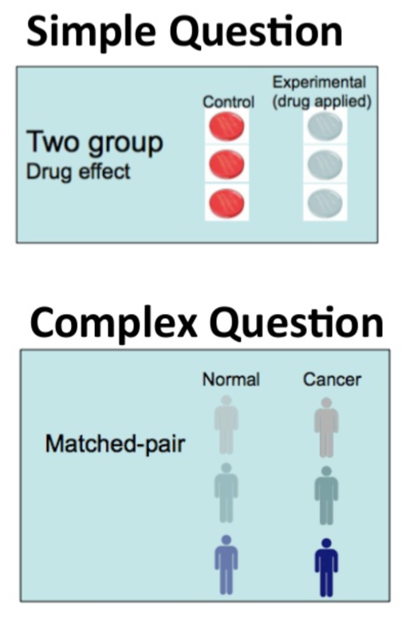
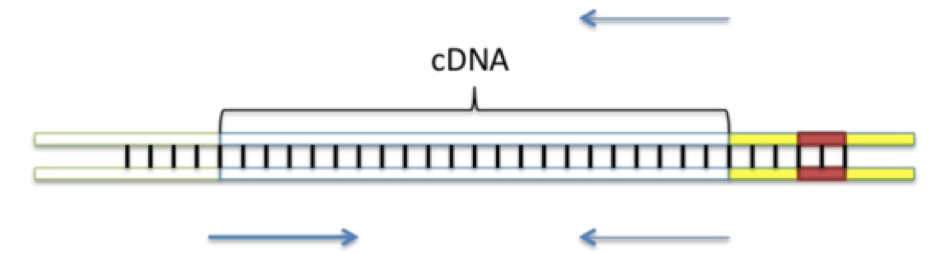
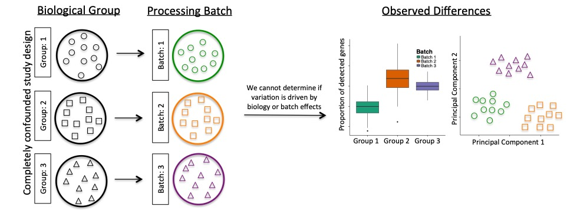

```{r setup, include=FALSE}
knitr::opts_chunk$set(echo = FALSE)
```

# ¿Cúal es la pregunta que se quiere contestar?


```{r, out.width = "290px",fig.align='center'}

```


---

## ¿Cúal es la pregunta que se quiere contestar?

--

Consideraciones importantes:

--

- **Single vs paired-end** (análisis de isoformas).

--

- **Stranded vs unstranded** (antisense y overlapping
transcripts).

--

- **Profundidad de la secuenciación** (detección de transcritos con baja abundancia). 

--

- **Número de replicas**:

--

  - *Biológicas* = independientes, muestras biologicamente distintas.
  
--
  
  - *Técnicas* = repetir la medición de la misma muestra.
  

--

.full-width[.content-box-red[Para el análisis de expresión diferencial es mejor **incrementar el número de replicas** que incrementar la profundidad de la secuenciación.]]

---

# ¿Qué es single-end y paired-end?

**Single-end**:  Lectura de un único extremo de cada fragmento. 


```{r, out.width = "900px",fig.align='center'}

```

--

**Paired-end**: La secuenciación pareada proporciona la secuencia de ambos extremos de cada fragmento, siempre separados por una distancia conocida.

.footnote[[Martínez, Javier María Rodríguez. "Secuenciación de genomas." Arbor 177.698 (2004): 285-310.](http://www.encuentros.uma.es/encuentros138_9/secuenciacion.pdf)]

---

# Profundidad de la secuenciación

- Mayor profundidad permite deterctar transcritos con baja expresión (Entre más *reads* tengas, encontrarás mayor cantidad de genes).

- Se requiere un incremento logarítmico en la profundidad de secuenciación para obtener un aumento lineal el la deteción de los genes. 

```{r, out.width = "900px",fig.align='center'}
knitr::include_graphics("images/depth.png")
```


---

# Precios

Es importante contemplar los costos dentro del diseño. La tabla muestra costos NO actualizados pero la tendencia es similar:

- Single-end es más baráto que paired-end.

--

- Mayor profundidad de secuenciación es más costoso. 

--

- Mayor longitud de bp por read aumenta el precio.

--
```{r, out.width = "800px",fig.align='center'}
knitr::include_graphics("images/cost.png")
```

---

# Precios del langebio

Tomados de su página de internet [langebio](http://labsergen.langebio.cinvestav.mx/en/?services=sbssequencing)

.pull-left[
### Precios de librerias

- 1 Library from DNA: $ 222.00

- 16 Libraries from DNA: $ 89.00 c/u

- 1 Library from total RNA or messenger RNA: $ 408.00

- 16 Libraries from RNA: $ 153.00 c/u

- 8 Small libraries RNA: $ 191.00 c/u

]

--

.pull-right[
### Precios de secuenciación


- Running on MiSeq 2x300: $ 2,687.00

- Run on NextSeq 2x150, High Yield: $ 7,396.00

- Running on a HiSeq 2x100 lane : $ 3,490.00

]

.small[
*Note: The price of libraries may vary depending on the number of samples to process.
]
---

## ¿Cuáles son las posibles fuentes de variación? 

.full-width[.content-box-blue[Conoce el fenómeno que quieres estudiar]]

.pull-left[

```{r, out.width = "200px",fig.align='center'}

```
]

--

.pull-right[

- **Variación biológica**: Sexo, edad, background genético, etnicidad, etc.

--

- **Variación técnica**: Día de procesamiento de la muestra, lotes de reactivos, tiempo de recoleción de muestras, personal, etc.
]


---

# Diseño experimental 

Es importante considerar la **variación biológica** al planear el experimento, porque puede generar variación no deseada que no puede ser eliminada.

```{r, out.width = "900px",fig.align='center'}

```


.footnotesize[[doi.org/10.1101/025528](http://doi.org/10.1101/025528)]


---

# Diseño experimental balanceado

Cuando las muestras se colectan en diferentes lotes es importante incluir diferentes grupos para detectar la **variación técnica**. Visualizar los datos usando algoritmos de redución de dimensiones ayuda a observar si las muestras tienen efectos por lote. 

```{r, out.width = "900px",fig.align='center'}
knitr::include_graphics("images/balanced.jpg")
```


.footnotesize[[doi.org/10.1101/025528](http://doi.org/10.1101/025528)]


---

# Quiz 

