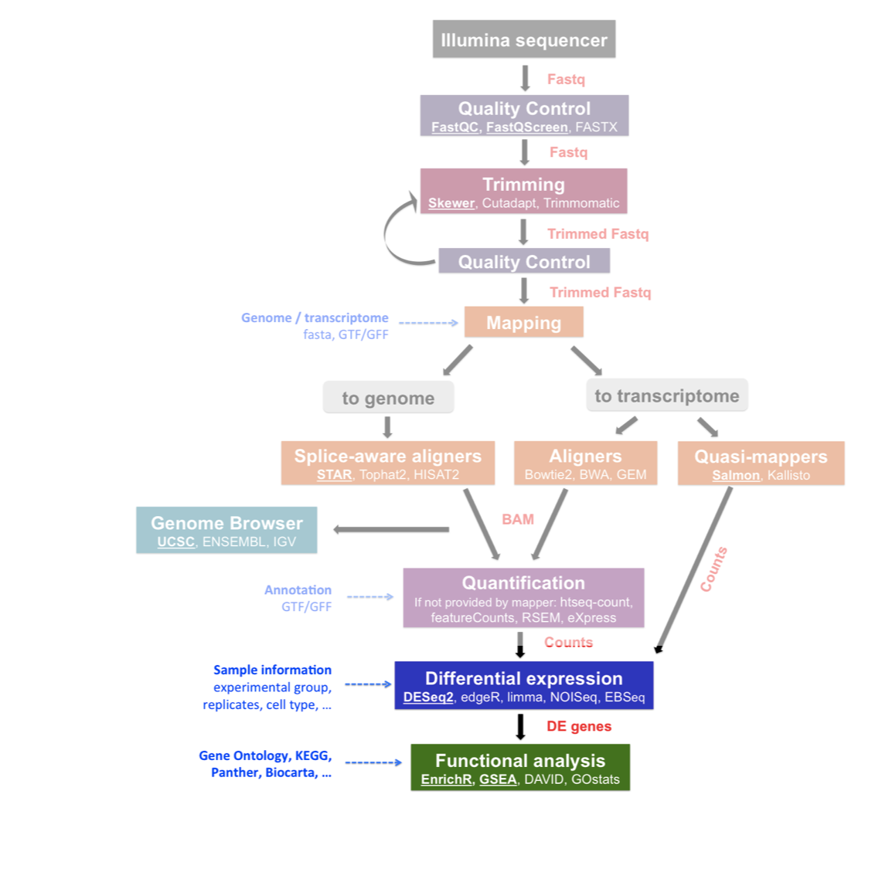

```{r setup, include=FALSE}
knitr::opts_chunk$set(echo = FALSE)
```


```{css, echo = FALSE}
/* From https://github.com/yihui/xaringan/issues/147  */
.scroll-output {
  height: 80%;
  overflow-y: scroll;
}
/* https://stackoverflow.com/questions/50919104/horizontally-scrollable-output-on-xaringan-slides */
pre {
  max-width: 100%;
  overflow-x: scroll;
}

```


## Recordatorio

¿Dónde estamos?

```{r, out.width = "450px",fig.align='center'}
knitr::include_graphics("https://biocorecrg.github.io/RNAseq_course_2019/images/RNAseq_workflow.png")
```

.tiny[Imagen tomada de [aquí](https://biocorecrg.github.io/RNAseq_course_2019/salmon.html)]


---

## Recordatorio

¿Dónde estamos?

```{r, out.width = "450px",fig.align='center'}

```
 
.tiny[Imagen tomada de [aquí](https://biocorecrg.github.io/RNAseq_course_2019/salmon.html)]

---

## Tximeta

Paquetería que conserva 

```{r, out.width = "650px",fig.align='center'}
knitr::include_graphics("https://journals.plos.org/ploscompbiol/article/figure/image?size=large&id=10.1371/journal.pcbi.1007664.g001")
```
 

.tiny[[Love, Michael I., et al. "Tximeta: Reference sequence checksums for provenance identification in RNA-seq." PLoS computational biology 16.2 (2020): e1007664.](https://journals.plos.org/ploscompbiol/article?id=10.1371/journal.pcbi.1007664)]


---

## Importar datos

.scroll-output[

Utilizamos `tximeta` para importar los datos. 

..content-box-red[

Nota: `tximeta` espera dos columnas:

  - `files`: con la rut a `quant.sf`
  
  - `names`: con los nombres de las muestras

]

Importamos la información de cada muestra

```{r echo=TRUE}
# Leemos los datos
info <- read.delim(here::here("output/salmon_quants/metadata.txt"))

# Generamos la columna "names"
info$names <- info$Unique_id
info
```


Ahora las cuentas generadas por `Salmon`, para ello 

```{r echo=TRUE}
# Ubicamos el dir de trabajo
dir <- file.path(here::here("output/salmon_quants"))
#Checamos que esten los folders  
list.files(dir) 

# Que hacemos aqui??  Checar
# file.path(dir,paste0(info$Sample,"_quant"),"quant.sf")
info$files <- file.path(dir,paste0(info$Sample,"_quant"),"quant.sf")

#Checamos que los archivos existan
data.frame(info$Sample, file.exists(info$files))
```

Importar los datos usando `tximeta` 


```{r echo=TRUE}
#BiocManager::install("tximeta")
library("tximeta")
se <- tximeta(info)
```


]


